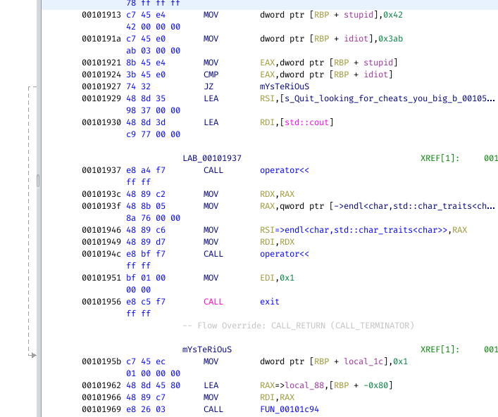
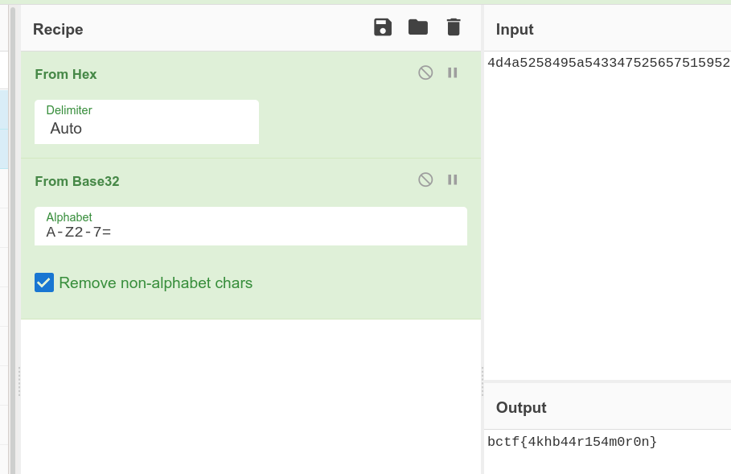

# roulette_wheel

**Category**: Rev \
**Points**: 491 (15 solves) \
**Author**: akhbaar

## Challenge

Akhbaar has opened an online casino to pass time during the pandemic. Come play
at the roulette wheel.

Attachments: `wheel`

## Overview

Let's run it:
```
$ ./wheel
Welcome to the roulette wheel
What do you want to do?
Press 1 for a hint
Press 2 to choose
Press 3 to play
1
VHJ5IGhhcmRlcgo=  [decodes to "Try harder"]
What do you want to do?
Press 1 for a hint
Press 2 to choose
Press 3 to play
2
What's your lucky number?
50
What do you want to do?
Press 1 for a hint
Press 2 to choose
Press 3 to play
3
Let's see what happens
You chose:
50
0
0
0
0
0
The wheel chose....
105705637
1028584130
48485172
1664399145
600011916
1754206873
Better luck next time, come again soon
```

Ok great but WHERE'S THE FLAG??? Decompile `main` in Ghidra (btw it's C++ so
the output is ugly af)
```c
...
          if (input != 1) break;
          hint(local_98);
        }
        if (input != 2) break;
        pick_numbers(local_98);
      }
      if (input == 3) {
        play(local_98);
      }
      else {
        if (input == 4) {
          WHATS_THIS(local_98);
        }
...
```

There's a hidden option 4:
```
$ ./wheel
Welcome to the roulette wheel
What do you want to do?
Press 1 for a hint
Press 2 to choose
Press 3 to play
4
Quit looking for cheats you big baby!
```

Ghidra it looks like:
```c
void no_cheats(void)

{
  basic_ostream *this;

  this = std::operator<<((basic_ostream *)std::cout,"Quit looking for cheats you big baby!");
  std::basic_ostream<char,std::char_traits<char>>::operator<<
            ((basic_ostream<char,std::char_traits<char>> *)this,
             std::endl<char,std::char_traits<char>>);
                    /* WARNING: Subroutine does not return */
  exit(1);
}
```

Wow ok. But still, WHERE THE FUCK IS THE FLAG???

Don't feel like guessing, so time for some challenge author OSINT!!!  I find
his profile on GitHub and luckily he has a CTF writeups repo! I bet I'll find
something interesting in there!!

Wow his
[writeup](https://github.com/akhbaar/ctf-writeups/blob/master/0x414141-2021/hash.md)
for Hash from [0x41414141 CTF](https://ctftime.org/event/1249) explains how the
challenge has deadcode (code behind an `if` statement that's always false) so
Ghidra that doesn't show it! How sneaky!! I bet he used the same trick here!!

Guess what:



My two variables `stupid` and `idiot` are set to `0x42` and `0x3ab` and
compared. If the answer is true (which happens NEVER) it jumps to this
`mYsTeRiOuS` label.

Now just patch the instruction with `Ctrl+Shift+G` and boom suddenly we see a bunch
of code appear in the decompilation output, particularly
```c
printf("0x%x\n",0x4d4a5258);
printf("0x%x\n",0x495a5433);
printf("0x%x\n",0x47525657);
printf("0x%x\n",0x51595255);
printf("0x%x\n",0x47525a44);
printf("0x%x\n",0x434e4a55);
printf("0x%x\n",0x4e555948);
printf("0x%x\n",0x454d444f);
printf("0x%x\n",0x50554641);
printf("0x%x\n",0x3d3d3d3d);
```

Unhex the numbers, Base 32 decode, (who the fuck uses Base 32?) and we get the flag:


