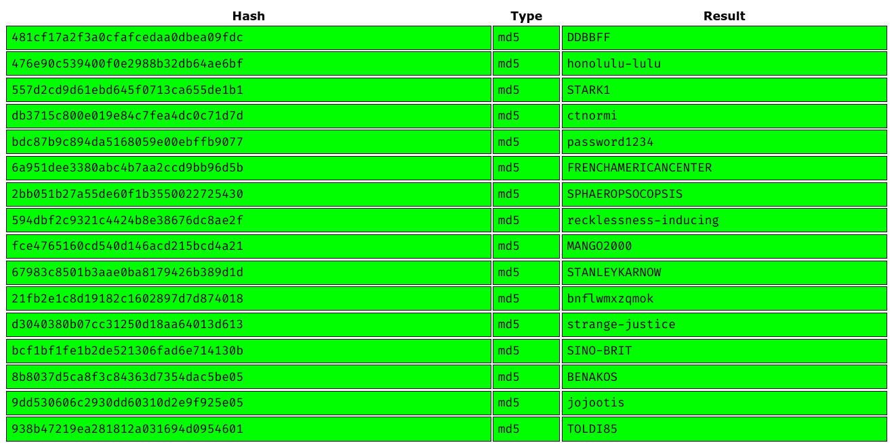

# hav3-i-b33n-pwn3d

**Category**: misc \
**Points**: 493 points (15 solves) \
**Authors**: hm3k, Lance Roy

I want to check if any of my passwords have been stolen, but I don't want to
risk sending them to [Have I Been Pwned](https://haveibeenpwned.com/Passwords).
I want a stronger guarantee than the
[k-anonymity](https://blog.cloudflare.com/validating-leaked-passwords-with-k-anonymity/)
that they provide. You can help me by submitting any leaked passwords you may
find to a [private set intersection protocol](https://eprint.iacr.org/2021/1159).

Usage: `./psi_sender.py password1234 notthepassword fall2021`

## Overview

Running the sample command, we get
```
$ ./psi_sender.py password1234 notthepassword fall2021
Some of my passwords have been leaked! I'll change them when I get around to it...
```

Basically the server (receiver) has a set of passwords, and we (the sender)
also have a set of passwords. The service allows us to check if any passwords
lie in the intersection of these two sets.

The goal of Private Set Intersection is to ensure that neither party can learn
the passwords outside of this intersection. At first this sounds impossible,
but the challenge does seem to provide a pretty convincing implementation.

The goal of the challenge is to break the Private Set Intersection protocol and
recover all passwords from the receiver.

## Solution

The protocol is a little complicated, so I'll only focus on the vulnerable part,
which is in the receiver code:

```py
for i in range(len(passwords)):
    b = sample_R()
    p = b * base_p

    bs.append(b)

    key = F(md5(passwords[i].encode()))

    px, py = p.xy()
    xs.append((key, px))
    ys.append((key, py))

x_poly = R.lagrange_polynomial(xs)
y_poly = R.lagrange_polynomial(ys)

send(str(x_poly))
send(str(y_poly))
```

Notice that `(x_poly(key), y_poly(key))` is a valid point on the elliptic curve.

In other words, if we can find all `key` such that the curve equation
```
(y_poly(key))^2 = (x_poly(key))^3 + 486662 * (x_poly(key))^2 + x_poly(key)
```
holds, then we have the MD5 hashes of all the receiver's passwords.

Luckily SageMath makes this pretty easy:
```py
p = 2 ^ 255 - 19
E = EllipticCurve(GF(p), [0, 486662, 0, 1, 0])
F = GF(p)
R = F["x"]
x = R.gen()

# fmt: off
x_poly = 23210701487548698406091826073280572544953962837267896823361016809714892399811*x^15 + 12205412197677241005719865494023353737086295156360923189568484136110953194241*x^14 + 22980244748006061010183613574173403969841215263701451750794007352168929246640*x^13 + 19354523012267394984724496830807124902378528188162576754284417523426075555919*x^12 + 48645912434403565323833785380078037520072265525100989793863114534522079479046*x^11 + 41906799907965687384993449502979620768926540707290863227387772969895837092796*x^10 + 45830397811285232086037812765756462744390924596916760753813718178479936544731*x^9 + 38454061763763210831533747953586273012195958495865803147445059248691265511488*x^8 + 32462746155120967562965393096784807453768330419148678514485303349150547163929*x^7 + 25059968186004095387039551562295676746361662200185349888308278222738517525385*x^6 + 52733592946047904186115433841783159666252610024934523780093497849090645307108*x^5 + 4034696246266611214558178317006351701561039878310248667268243127048374038854*x^4 + 4422694891050047750412646686075949546916027708090043036534509587455466120762*x^3 + 50592246712985357348014765005410595537786574137526551505886467686337957803001*x^2 + 424884963482051761424765837112643617813313970229989349645612570804932881164*x + 37847620571788927114457374360745884427179929124996770650999581740956936139075
y_poly = 15189686553954905502343242605103410312815660183431786345409335639545295667393*x^15 + 978579482392418687647672418783253230651376263532912793420246448053487392778*x^14 + 41368691906023584866499309347754386957077078067992456902149106437178734230690*x^13 + 8963309233294751867560552902015796113541259545337421730103014732581558505835*x^12 + 39317409791383481883892273684013408497423164788363470514393170621722880218196*x^11 + 20448071081340268920719485471793445157104298079463047100448479880766419251793*x^10 + 12050561545363077331658880990913568057469301284970571244552446350533305326511*x^9 + 17797371663128276150170713754593712084446236185797073731600110937673286776805*x^8 + 20265410234032688750223412974507797967678880075057492741940950103819557865154*x^7 + 46388842227458376380169456368548129846473368874422273620430414474738970542083*x^6 + 8053414838243910838958804041062882031221914673803083346401269136167122370773*x^5 + 39369384368468550866102939002439884525901686431194626629115183366810614266495*x^4 + 7978184712861366864888687806621681029717817320054415898350121811519927497705*x^3 + 37981625437325317034951429106457909245010446262561311375326846203373707132942*x^2 + 16215399830570665430747806406329237274696556877296485020709899405240396341612*x + 20608044989774673638321119236249531987995078243392377741923633215026872869460
# fmt: on

f = x_poly ^ 3 + 486662 * x_poly ^ 2 + x_poly - y_poly ^ 2

# There may be some other roots that we don't care about
roots = [r[0] for r in f.roots() if r[0] < 2 ^ 128]

for r in roots:
    print(int(r).to_bytes(16, 'little').hex())
```

Plugging these into https://crackstation.net/, we get



```
$ ./psi_sender.py DDBBFF honolulu-lulu STARK1 ctnormi password1234 FRENCHAMERICANCENTER SPHAEROPSOCOPSIS recklessness-inducing MANGO2000 STANLEYKARNOW bnflwmxzqmok strange-justice SINO-BRIT BENAKOS jojootis TOLDI85
They've all been pwned?! Really?!?! Please hold my flag while I go change them.
dam{I_DoN'T_KnOw_1f-i-wAs-pwN3D_8U7-1_$ur3-@M-nOW}
```

## Note

I spent 9 hours bruteforcing from 3 GB [wordlist](https://github.com/berzerk0/Probable-Wordlists/blob/master/Real-Passwords/Real-Password-Rev-2-Torrents/ProbWL-v2-Real-Passwords-7z.torrent), which successfully found 8 passwords. Then I went to bed and the next morning and randomly thought of the solution above.
