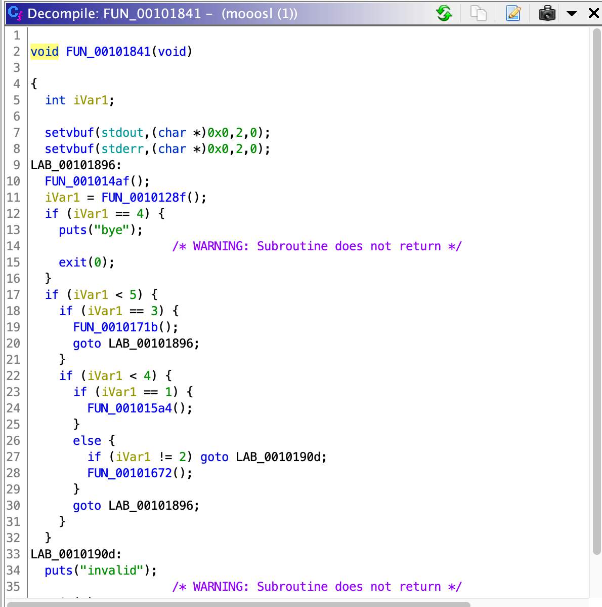
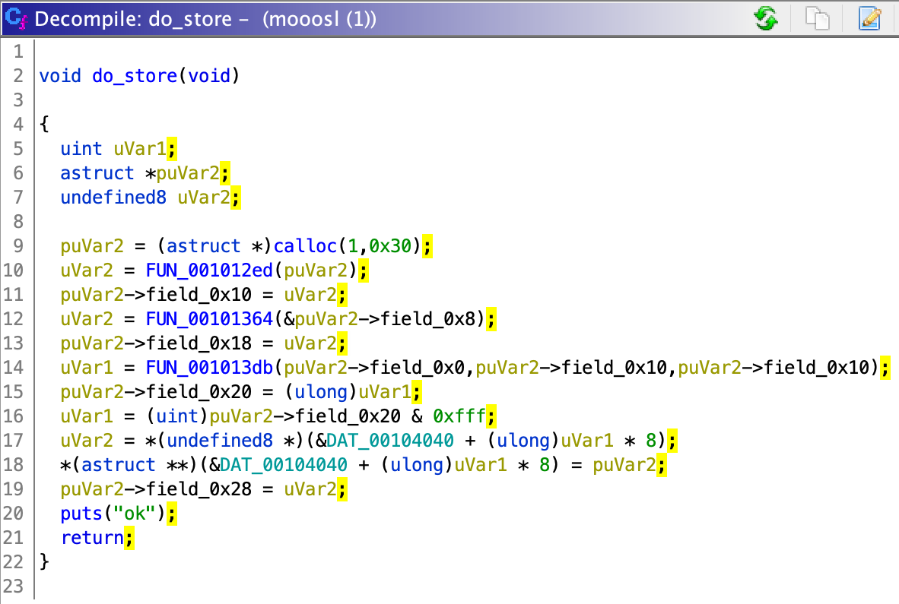

# Mooosl

**Category**: Pwn

**Points**: 177 (18 solves)

**Author**: ?

## Challenge

**Description**: check my new baby toy! (Ubuntu 21.04: apt install musl)

**Attachments**: libc.so, mooosl

**I did not solve this challenge during the competition. After reading about some techniques others applied (mentioned below) I finished my solution two days later.**

I am going to try to go through this challenge with as much detail as possible. Perhaps a painful amount of deetail. If you just want to see the exploitation technique, you probably want to scroll down to Part 4.


## Part 1. Obtain and Run the Challenge

They told us to `apt install musl`, so we can google "apt musl" to find out this is installing the "musl" libc implementation. This also explains the challenge name.

Okay, so they gave us two files:
- libc.so (presumably, this is the same libc that you get by doing `apt install musl`)
- moosl
```
$ file mooosl
mooosl: ELF 64-bit LSB shared object, x86-64, version 1 (SYSV), dynamically linked, interpreter /lib/ld-musl-x86_64.so.1, stripped
```

Ok, so it's a 64-bit x86 executable, it's dynamically linked, and will use /lib/ld-musl-x86_64.so.1 as the linker. (Luckily, `apt install musl` also installed the linker in that exact location.)

I'm also going to run checksec to see if it was compiled with all the security mitigations or not.
```
$ checksec mooosl
[*] '/home/andrew/moosl/mooosl'
    Arch:     amd64-64-little
    RELRO:    Full RELRO
    Stack:    Canary found
    NX:       NX enabled
    PIE:      PIE enabled
```

OK - so all protections enabled. This is DEFCON Quals, after all.

To check my sanity, I want to make sure the libc that is getting loaded when the process runs is the same as the libc that they gave us.

So I ran `gdb ./mooosl` and then typed `run` and then pressed CTRL-C to interrupt the program, and then `info proc mappings` to get a list of memory mappings:

```
gef> info proc mappings
process 7409
Mapped address spaces:

          Start Addr           End Addr       Size     Offset objfile
      0x555555554000     0x555555555000     0x1000        0x0 /home/andrew/moosl/mooosl
      0x555555555000     0x555555556000     0x1000     0x1000 /home/andrew/moosl/mooosl
      0x555555556000     0x555555557000     0x1000     0x2000 /home/andrew/moosl/mooosl
      0x555555557000     0x555555558000     0x1000     0x2000 /home/andrew/moosl/mooosl
      0x555555558000     0x555555559000     0x1000     0x3000 /home/andrew/moosl/mooosl
      0x555555559000     0x555555561000     0x8000        0x0 [heap]
      0x555555561000     0x555555562000     0x1000        0x0 [heap]
      0x555555562000     0x555555563000     0x1000        0x0 [heap]
      0x7ffff7f41000     0x7ffff7f45000     0x4000        0x0 [vvar]
      0x7ffff7f45000     0x7ffff7f47000     0x2000        0x0 [vdso]
      0x7ffff7f47000     0x7ffff7f5c000    0x15000        0x0 /usr/lib/x86_64-linux-musl/libc.so
      0x7ffff7f5c000     0x7ffff7fc3000    0x67000    0x15000 /usr/lib/x86_64-linux-musl/libc.so
      0x7ffff7fc3000     0x7ffff7ffa000    0x37000    0x7c000 /usr/lib/x86_64-linux-musl/libc.so
      0x7ffff7ffa000     0x7ffff7ffb000     0x1000    0xb2000 /usr/lib/x86_64-linux-musl/libc.so
      0x7ffff7ffb000     0x7ffff7ffc000     0x1000    0xb3000 /usr/lib/x86_64-linux-musl/libc.so
```

Okay, so it's getting libc from `/usr/lib/x86_64-linux-musl/libc.so`. 

```
$ md5sum libc.so
0cb0503eb60496782d21cf9b26d61c01  libc.so

$ md5sum /lib/x86_64-linux-musl/libc.so
40dcd7cec2b87e3f65a6b96ec6d383d3  /lib/x86_64-linux-musl/libc.so
```

Uh oh, the libc I got with `apt install musl` is not the same as the libc they gave us. This is probably because I'm on Ubuntu 20.10 and not Ubuntu 21.04. We want to have the *exact same environment* as the remote server, otherwise our exploit may work locally but not remotely. I tried a couple of tricks (LD_PRELOAD, LD_LIBRARY_PATH) to get it to load the libc out of the current directory instead, but I was unsuccessful. Since this is the only thing using musl libc on this system and I'm lazy, I just copied the libc they gave us over the one from apt:

```
cp libc.so /usr/lib/x86_64-linux-musl/libc.so
```

OK great, we can now run the program and are confident we have the correct libc version.

## Part 2. Understand the Challenge

We are greeted with a prompt which gives us a number of options.

```
$ ./mooosl 
1: store
2: query
3: delete
4: exit
option: 
```

Those of us who are not strangers to pwn know this *wreaks* of a heap challenge. (Why? 'store' => `malloc`, 'delete' => `free`, 'query' => print out the contents of an allocation).

I tried a few inputs, and made some observations:

```
$ ./mooosl 
1: store
2: query
3: delete
4: exit
option: 1
key size: 10
key content: ffffff
value size: 60
value content: FFFFFFFFFFFFFFFFFFFFFFFFFFFFFFFFFFFFFFFFFFFFFFFFFFFFFFFFFFFFFFFFFFFFFFFFFFFFFFFFFFFFFFFFFFFFFFFFFFFFFFFFFFFFFFFFFFFFFFFFFFFFFFFFFFFFFFFFFFFFFFFFFFFFFFFFFFFFFFFFFFFFFFFFFFFFFFFFFFFFFFFFFFFFFFFFFFFFFFFFFFFFFFFFFFFFFFFFFFF
ok
1: store
2: query
3: delete
4: exit
option: invalid
$ FFFFFFFFFFFFFFFFFFFFFFFFFFFFFFFFFFFFFFFFFFFFFFFFFFFFFFFFFFFFFFFFFFFFFFFFFFFFFFFFFFFFFFFFFFFFFFFFFFFFFFFFFFFFFFFFFFFFFFFFFFFFFFFFFFFFFFFFFFFFFFF
FFFFFFFFFFFFFFFFFFFFFFFFFFFFFFFFFFFFFFFFFFFFFFFFFFFFFFFFFFFFFFFFFFFFFFFFFFFFFFFFFFFFFFFFFFFFFFFFFFFFFFFFFFFFFFFFFFFFFFFFFFFFFFFFFFFFFFFFFFFFFFF: command not found
```

- It seems to be some kind of key-value store. A hash table? what happens on collisions??
- It asks for size of the key and value, and if you input fewer bytes, it stops on newline
- If you input too may bytes it doesn't read them in (it tried to read my Fs as the next "option:" input instead)

```
$ ./mooosl 
1: store
2: query
3: delete
4: exit
option: 1
key size: 2
key content: f
value size: 10
value content: lololol
ok
1: store
2: query
3: delete
4: exit
option: 2
key size: 2
key content: f
0x7:6c6f6c6f6c6f6c
ok
1: store
2: query
3: delete
4: exit
option: 1
key size: 2
key content: f
value size: 10
value content: yyyyyyy
ok
1: store
2: query
3: delete
4: exit
option: 2
key size: 2
key content: f
0x7:79797979797979
ok
1: store
2: query
3: delete
4: exit
option: 4
bye
```

- It prints my input in hex (0x<SIZE>:<SIZE hex bytes>), size was the # of bytes actually read, not the number I entered
- I stored two things for the same key. When I did query, I got the _second_ one I stored.


That's about all I cared to explore dynamically for the moment -- lets pop it into Ghidra.

## Part 3. Find the bug

Find main. It looks like this:



The first call prints the menu. The second call (FUN_0010128f) calls some function and then does `atoi` on it (atoi reads a string and returns the decimal integer that was in it), so it's probably reading the option selected by the user.

Ghidra has the wrong function signature for FUN_0010128f; we notice this because the return value of atoi is unused and when main calls this function it uses its return value. Edit the function signature to correct the return type, for more accurate decompilation.


With this knowledge, we know that iVar1 containst the option entered by the user. So we can label the diffrent branches accordingly.


Lets dive into `do_store`.


The first thing store does is calloc 0x30 bytes (calloc is just malloc, but it zeroes the region before you get it) - the pointer goes in `puVar2`. Then, we see three function calls and a bunch of operations relative to puVar2. Whenever we see a bunch of specific array subscripts on a pointer, we can suspect that this is actually a pointer to a structure, not an array of 8-byte values.

We know the structure is 0x30 bytes, and every member to be 8 bytes (there is no wacky math on puVar2, and it's never cast to any other type). For now, we don't know the names of the members. There's a cool Ghidra feature that will auto-generate this structure for you (normally, i've just done it in the 'Data Type Manager' window).




Cool, lets try to figure out what each function does now. The first function, once you fix the argument type, looks like this:


We see that it prompts for a key size, we calloc that size, then we set the value at p2buf to the new chunk we just allocated. Next, this function calls FUN_001011e9. I am omitting this for brevity, but it just `read`s one character at a time from the user into arg1, until either \n is reached or we've written `len` (arg2) characters. It returns the number of chars read. (Note, it does not null-terminate the string, but it won't matter because this value isn't treated anywhere as a string). I'm naming this function `read_until_newline`.

Going back out to `do_store`, we can label that first call as a call to `get_key_from_user`. 

Notice that the argument is just puVar2 -- this is a pointer to the structure, which is also a pointer to the *first member of the structure*, `field_0x0`. So we know that get_key_from_user is going to set `field_0x0` to the pointer it gets from its calloc call... that was where the key was stored! So we can rename `field_0x0` to `key_buf`. 

The return value of `get_key_from_user` is the return value of `read_until_newline` (the number of characters read). So `field_0x10` is the `key_len`.


The next function that is called is FUN_00101364. We'll notice a very similar pattern here, except we are reading in the value instead of the key. So `field_0x8` is the `value_buf`. And `field_0x18` is the `value_len`. We've filled in over half the struct!

So far, we haven't seen much interesting. Just labelling struct members. That's about to change with `FUNC_001013db`. Here's how it gets called in do_store:


We need a important observation about how the return value of the mysterious `FUNC_001013db` gets used: It gets stored in field_0x20 and then they mask it with `0xfff`, and use it as an index into a global `DAT_00104040` (an array of pointers!). They pull the old pointer from `&DAT_00104040 + uVar1 * 8`. Then they store the new pointer in that same spot, and set field_0x28 to the old pointer. **This is insertion into the beginning of a singly-linked list**. FUNC_001013db is the *hash function*, whose lower 12 bits are used as an index to select which "bucket" the new node should be added to. Nodes are always inserted at the beginning of the list.

Here's the hash function:


Those are some cool constants: 2021 and 0x13377331. So we know the first param is the key buffer and the second param is the key length. It iterates over every character in param_1 by incrementing local_14 as an index. For every character it computes:
```
val = (ulong)current_character + val * 0x13377331
```
with val = 0x7e5 (2021) as the starting condition, and it returns val. I played around with this equation a bit, it turns out its a linear diophantine equation and I tried to get SymPy to solve it but I wasn't thrilled with those results.

Luckily, a brute force search over the space of all two-byte keys is very effective at finding collisions (keys whose hash value & 0xfff yields the same thing)

```python
START = (0x7e5)
def brute_force_collision(desired_bucket):
    options = []
    for x in range(256):
        for y in range(256):
            cur_num = START
            cur_num = ((x + cur_num * 0x13377331))
            cur_num = ((y + cur_num * 0x13377331))
            if (cur_num & 0xfff) == desired_bucket:
                options.append(bytes([x, y]))
    return options
```

This will return a 2-tuple for every 2-byte key that hashes to the same hash table bucket.

So for bucket 0 (whose head pointer is at DAT_00104040), we can use any of these byte strings: 

```
>>> brute_force_collision(0)
[b'\x02\xd9', b'\x07\xe4', b'\x0c\xef', b'\x11\xfa']
```

So far, there's nothing wrong with the fact we might have a hash collision. Some keys will hash to the same thing (& 0xfff) so those nodes will be inserted into the same bucket. If we check the do_query function, we'll see it actually does a memcmp (in the function at 0x1014fb) on the two keys to make sure it's found the right node before printing it. There's nothing wrong with this aspect of the implementation of chained hashing.

## The bug

Let's take a look at `do_delete`. Remember that `do_store` effectively did a linked list insert at the beginning of the list, so we expect `do_delete` to handle removing from a linked list.


I've already labelled one key function without telling you: `get_node_by_key` at 0x1014fb. This function (actually only takes two parameters) does a linked list traversal until it finds the node matching a particular key, and returns a pointer to the node if it finds it. I'll leave that one for you to look at on your own. No issue there.

Let's try to label a variable or two:
- local_18, returned by get_node_by_key... from REing get_node_by_key we know it returns a pointer to a node in the list, depending on the key the user typed. Going to name `node_to_delete`.


Let's look closely at what happens when `get_node_by_key` returns non-null (aka it found the node to delete).


It gets a pointer to the list head from the global (line 20), then it checks:
- If the node we are trying to delete is the list head
- OR the node we are trying to delete is NOT the list tail (->next is not null)

If either of these conditions is satisifed, it actually unlinks correctly: The loop finds the pointer to change (the previous node's next pointer, or the pointer to the head of the list) and then changes it to new next node.

But what happens when neither of these conditions are satisfied? That is, the node we are deleting is not the first node, but *is* the last node. We skip the unlinking entirely, but still free the key buffer, value buffer, and the node itself.

This means that if we 'delete' the last node in a list of at least two elements, the previous node *still references the node we just free'd*.

This one bug leads to essentially two vulnerabilities:
- Use-after-free: The node is still in the linked list. We can still use the 'query' function to print out its value.
- Double free: We can still use the 'delete' function to free the same node (and it's key and value buffers) again, since the node is still in the linked list.

## Part 4: Experimenting with the musl libc heap

So, I've done a little glibc heap exploitation before, so I had a few *broad assumptions* about how the heap would work here:

- If I make some allocations of size X (X < 4096-ish), and then I free one of them, and then I make some allocations of size X again, I expect to *eventually* get the chunk I free'd back. (This holds mostly true.)


Since I don't know anything about the musl implementation of the heap, and I want to verify these assumptions, I created a little gdb script to log every allocation and free. We can pass this to `gdb.attach` in pwntools, or run gdb with `-x`.

```
# Output to gdb.txt
set logging on

# Define a function for handling calloc breakpoints
# (yes, it has to be a separate function)
define foo
printf "calloc"
print $rsi
finish
print $rax
c
end

b calloc
commands
foo
end

# Define a function for handling free breakpoints
define bar
printf "free"
print $rdi
c
end

b free
commands
bar
end
```

(You could also use LD_PRELOAD as mhackeroni did: https://github.com/Ikiga1/writeups/tree/master/DefConQuals2021/mooosl to get the same diagnostics without the struggles of gdb)

I wrote simple functions to do `store`, `delete`, and `query`. (See [solve.py](https://github.com/cscosu/ctf-writeups/blob/master/2021/def_con_quals/mooosl/solve.py)). `store` allows for a controlled key and value size. `delete` and `query` allow for controlled key size.

```
def store(key, value, keysize=None, valuesize=None):
    ...
def delete(key, keysize=None, error=False):
    ...
def query(key, keysize=None)
    ....
```

Let's try a simple experiment to see what we can do with the use-after-free. I will be using the colliding keys found in Part 3 above.

1. `store(b'\x02\xd9', b'yeet', keysize=0x8, valuesize=0x20)`
2. `store(b'\x07\xe4', b'yeeticus', keysize=0x8, valuesize=0x20)`
3. `delete(b'\x02\xd9')` This will delete the last node in the list, but it will not be unlinked.
4. `store(b'\x0c\xef', b'yeeticus maximus', keysize=0x8, valuesize=0x20)` Store always inserts at the beginning of the list.
5. Repeat 4 two more times, to see when we get the deleted node back

Here's the sequence of calloc and free that we see:

```
# Store 1: allocate node (always 0x30)
calloc$1 = 0x30
$2 = 0x7f5071cbdc60

# Store 1: allocate key (controlled size)
calloc$3 = 0x8
$4 = 0x559ad37fcc60

# Store 1: allocate value (controlled size)
calloc$5 = 0x20
$6 = 0x7f5071cbd870

# Store 2: allocate node (always 0x30)
calloc$7 = 0x30
$8 = 0x7f5071cbdca0

# Store 2: allocate key (controlled size)
calloc$9 = 0x8
$10 = 0x559ad37fcc70

# Store 2: allocate value (controlled size)
calloc$11 = 0x20
$12 = 0x7f5071cbd8a0

# Delete: allocate key (controlled size)
calloc$13 = 0x3
$14 = 0x559ad37fcc80

# Free key for 1st store (we know via order of free's we see in Ghidra)
free$15 = 0x559ad37fcc60

# Free value for 1st store
free$16 = 0x7f5071cbd870

# Free node for 1st store
free$17 = 0x7f5071cbdc60

# Remove key from above delete
free$18 = 0x559ad37fcc80

# Store 3
calloc$19 = 0x30
$20 = 0x7f5071cbdce0

calloc$21 = 0x8
$22 = 0x559ad37fcc90

calloc$23 = 0x20
$24 = 0x7f5071cbd8d0

# Store 4
calloc$25 = 0x30
$26 = 0x7f5071cbdd20

calloc$27 = 0x8
$28 = 0x559ad37fcca0

calloc$29 = 0x20
$30 = 0x7f5071cbd900

# Store 5
calloc$31 = 0x30
$32 = 0x7f5071cbdd60

calloc$33 = 0x8
$34 = 0x559ad37fccb0

calloc$35 = 0x20
$36 = 0x7f5071cbd930
```

A couple of things to notice here:
- `calloc` is returning a mix of heap pointers and libc pointers. Checking /proc/<pid>/maps, we find the two segments that the chunks are coming from:

    ```
    ...
    559ad52d0000-559ad52d1000 ---p 00000000 00:00 0                          [heap]
    559ad52d1000-559ad52d2000 rw-p 00000000 00:00 0                          [heap]
    7f5071c06000-7f5071c1b000 r--p 00000000 08:05 1837434                    /usr/lib/x86_64-linux-musl/libc.so
    7f5071c1b000-7f5071c82000 r-xp 00015000 08:05 1837434                    /usr/lib/x86_64-linux-musl/libc.so
    7f5071c82000-7f5071cb9000 r--p 0007c000 08:05 1837434                    /usr/lib/x86_64-linux-musl/libc.so
    7f5071cb9000-7f5071cba000 r--p 000b2000 08:05 1837434                    /usr/lib/x86_64-linux-musl/libc.so
    7f5071cba000-7f5071cbb000 rw-p 000b3000 08:05 1837434                    /usr/lib/x86_64-linux-musl/libc.so
    7f5071cbb000-7f5071cbe000 rw-p 00000000 00:00 0 
    7ffc65c3f000-7ffc65c60000 rw-p 00000000 00:00 0                          [stack]
    ...
    ```

    So, some of the pointers returned by malloc are in rw pages loaded immediately after libc (but not file-mapped), so we can assume this is the .bss segment. (You can confirm this when you load libc.so into Ghidra, which we might want later). The other chunks are in the \[heap\] segment as you'd expect.
- We never got any of our free'd pointers back! We need to ~~be more creative~~ try different patterns of allocations if we are going to try to re-allocate the free-d chunk. (or maybe we just need to make more allocations before we get the same chunk back)

At this point, it seems like it'd be good to develop a better understanding of the musl-libc heap.

## how does the musl-libc heap work

I found the current implementation here: https://github.com/ifduyue/musl/tree/master/src/malloc/mallocng

I didn't need to fully understand how this allocator works in order to solve this challenge, but I needed to understand how the chunk metadata works and where it is stored. The code is somewhat dense and not well commented, but we can infer *a lot* from one function in particular: [`get_meta`](https://github.com/ifduyue/musl/blob/master/src/malloc/mallocng/meta.h#L129):


This function gets called very early in free(), and is passed the argument to free (the start of user data).

Going line-by-line:

- Line 131: The user data must be 16-byte aligned
- Line 132: `offset` is a unsigned two-byte value stored immediately before the user data
- Line 133: `get_slot_index` is:
    ```c
    p[-3] & 31;
    ```
    so we know `index` is a unsigned 1-byte value (since p is ptr to unsigned char). It is stored three bytes before the user data and is being implicitly cast to int. `& 31` means the only the lower 5 bits are used.
- Line 134: There is a byte four-bytes before the user data that causes some additional checks if non-zero. We'll assume these won't matter for now.
- Line 139: **IMPORTANT:** Chunks are stored contiguously in 'groups', which share a `struct group` at the 'base' of the group. The 'offset' (stored immediately before the user data) specifies how far (in `UNIT`-sized units, `UNIT` is defined as 16) away the base of the group is.
- Line 140: The `struct group` has a pointer to a `struct meta`. Let's check out the struct definitions real quick:

    ```c
    struct group {
        struct meta *meta;
        unsigned char active_idx:5;
        char pad[UNIT - sizeof(struct meta *) - 1];
        unsigned char storage[];
    };

    struct meta {
        struct meta *prev, *next;
        struct group *mem;
        volatile int avail_mask, freed_mask;
        uintptr_t last_idx:5;
        uintptr_t freeable:1;
        uintptr_t sizeclass:6;
        uintptr_t maplen:8*sizeof(uintptr_t)-12;
    };
    ```
    So groups seemed to be further organized into 'metas' which serve as a linked-list of groups. Each 'meta' has a few intresting attributes we'll see soon.
- Line 141: The `struct group` points to a `struct meta` through ->meta, and the meta points back to the group via `->mem`. These pointers must match up.
- Line 142: The chunk's index must not exceed the meta's last_index.
- Line 143 - 144: avail_mask and free_mask are `int`s which are used as 'bitmaps' where bit i represents whether the chunk with index i is available, freed, or both. For a chunk to be freeable, it should be neither available nor freeed.
- Line 145: Every page (aligned 4096 byte chunk) that contains a `struct meta` must have a `struct meta_area` at the beginning of the page.
    ```
    struct meta_area {
        uint64_t check;
        struct meta_area *next;
        int nslots;
        struct meta slots[];
    };
    ```
- Line 146: `ctx` is a global (you can just grep for it to find this out), with a `secret` member which much apparently match the `check` of *every* meta_area.

- Line 147-152: The size class should be either 0-47 or 63. If we look elsewhere we see that mmap-ed chunks (for allocations of size > MMAP_THRESHOLD) are assigned size 63. For size class 0-47, it uses the size class as an index into some global array of sizes. It verifies that the chunk is *where it's supposed to be*: `offset` (which was in units of size UNIT) should be between the size class * index and size class * (index + 1). So apparently the size classes are in UNIT units.
- Line 153: This isn't important, let's try to avoid this check

From this, we can make a crappy diagram of the musl libc heap (high mem is down):


Chunk:
```
|
|----------- <-- 'struct group' (p - 16*off - 16)
| meta (8) - ptr to meta          
| active_idx (1)
|
|------------------
| **********************
| ** more chunks here **
| **********************
|------------------ <-- (p - 8), chunk start
| ???
| ???  (4)
| ???
| ???
|------------------
| ??? (1)
|------------------
| index (1)
|------------------
|
| offset (2)
|
|------------------ <-- p, returned from malloc
| user data
|
| ...
|
|
|----------- <-- Chnk end (p + 16*size_class - 8)
|                       
|*********************
|** more chunks here**
|*********************
|

```
(notice, i did not bother to reverse the members that I did not need)

Meta / Meta Area:
```
|------ meta area at 0xXXXXXX000
| check (8) - should match ctx.secret
| next (8)
| nslots (4)
| ...pad... (4?)
|------
|
| ... some more struct metas here
|
|
|------ meta at 0xXXXXXXYYY
| prev (8)
| next (8)
| mem (8) - ptr to group
| avail_mask (4)
| freed_mask (4)
| extras (8)
|-------

```

We will explore these structures again in Part 6.

A summary of differences between glibc and musl's new mallocng implementation:


|    glibc   |  musl (mallocng)  |
|-------|-------|
| Manages linked lists of chunks | Manages linked lists of 'metas', which are groups of contiguous chunks |
| Fwd/back stored in user data section of freed chunks | Nothing is stored in user data of free'd chunks |
| Chunk size is stored with chunk | Chunks appear in groups of the same size, they share a 'meta' pointer at the beginning of the group; the meta contains the size

## Part 5: Coming up with an exploitation strategy

### Arbitrary Read

First, we realize that we can use the 'query' functionality to print out the contents at the free'd node's `value` pointer. The node, the key buffer, and the value buffer *are all used after they are free'd*. 

```
 Chunk 1
|---------|                  Chunk 2
| key_buf |--------------->|---------|
|---------|     Chunk 3    |         |
| val_buf |-->|---------|  |_ _ _ _ _|
|---------|   |         |  |   ...   |
| key_len |   |_ _ _ _ _|
|---------|   |   ...   |
| val_len |
|---------|
| hash_val|
|---------|
| next    |
|---------|
```

We originally controlled the data in Chunk 3, but it's free'd now. If we can make chunk 3 get allocated again **as a node**, then we it will be filled with all the data a node normally has. The first 8 bytes in chunk 3 will be filled with a pointer to a buffer for the new node's key! We can use this to get both a libc leak **and** a heap leak, because we observed earlier that some pointers returned by calloc are in libc's .bss, and some are on the heap as expected. The `value` is printed as hex byte-by-byte, for however long `val_len` specifies, so null bytes will not pose an issue.

To get chunk 3 allocated again as a node, we need to ask for a key length of 0x30, which the same as the allocation size for the node. This strategy only works if we can get Chunk 3 allocated as a node before Chunk 1 gets allocated again -- if Chunk 1 gets allocated, it will get zeroed by calloc and we will no longer have a pointer into Chunk 3 that we can print from. Luckily, we noticed earlier that the heap is not LIFO (last-in-first-out) at all. With some trial and error we are able to achieve multiple allocations of Chunk 3 as a node while Chunk 1 stays intact.

Ok, so we can leak a heap pointer and a libc pointer, but that's not an *arbitrary* read advertised by the header of this section. For reasons I have not yet described, we want to leak the 'secret' member of the `malloc_context` structure, which resides in libc's .bss (You can find this by looking at the globals referenced by `malloc`/`free` in libc.so using Ghidra; the secret is at `001b4ad0` for me). To read this value, we need to re-allocate Chunk 1 as a 'value' and then overwrite the contents of the node so that the address we want to read (of the malloc_context secret) is in place of val_buf.

For this, it is convenient to have your chunks in bucket 0x7e5 (the bucket things fall into when for key length = 0) so we can zero those members out and still be able to locate our chunk.
```
 Chunk 1
|------------------------------|
| key_buf=0                    |
|------------------------------|
| val_buf=0x1b4ad0 + libc_base |
|------------------------------|
| key_len=0                    |
|------------------------------|
| val_len=0x8                  |
|------------------------------|
| hash_val=0x7e5               |
|------------------------------|
| next=0                       |
|------------------------------|
```

Then we can just 'query' for our chunk (w/ key length 0) and we it will print the value from val_buf, which is the secret value we want.

### Arbitrary Write?


Often with glibc heap problems, the goal is to corrupt the heap so that `malloc` returns a controlled address (e.g. via tcache posioning), giving you a write-what-where primative. Then, a typical target is `__free_hook` in glibc, which gets called with every pointer that gets free'd - you overwrite this to call `system` and then you just free some data you control to call `system` with your data.

We have a few problems:
- Making malloc return a controlled pointer is hard, because chunks are not linked together - rather, `struct meta`s (metadata for a group of contiguous, uniform chunks) are linked together. Getting malloc to return a controlled pointer in musl-libc would require constructing a fake `struct group` (pointing to a valid `struct meta`) and a fake chunk **somewhere near** where you want to write, and then somehow freeing a valid chunk in that group so that malloc would return chunks from that group in the future. I worked toward this approach, and there might be a way to make it work, but I couldn't.
- There is no `__free_hook` in musl. How can we use an arbitrary write to get code execution? 


Regarding turning arbitrary write into code execution, I found the answer in (the translation of) someone's [personal chinese blog](https://translate.google.com/translate?hl=en&sl=zh-CN&tl=en&u=https%3A%2F%2Fwww.anquanke.com%2Fpost%2Fid%2F202253&prev=search). The technique is called FSOP (File-stream oriented programming), and I had never heard of it before. There is a global [`FILE` structure](https://github.com/ifduyue/musl/blob/master/src/internal/stdio_impl.h#L21) that has some function pointers, so if we get arbitrary write then we can change one of these pointers. The pointers [get called upon `exit()`](https://github.com/ifduyue/musl/blob/cfdfd5ea3ce14c6abf7fb22a531f3d99518b5a1b/src/stdio/__stdio_exit.c#L12) with a pointer to the file structure. So we need to write `/bin/sh` at the beginning of the structure, and overwrite the `write` pointer to call `system`.

However, I struggled to figure out how to the double-free and UAF  into an arbitrary write. I had a libc and heap leak, and I knew I could turn a arbitrary write into code exeuction, but I didn't figure it out in time. One thing I had thought to try was that maybe mmap-ed chunks were treated differently, and that maybe I could construct a fake mmap-ed chunk -- this didn't work, since I didn't have anywhere I could construct the fake chunk that was close enough to `libc`'s .data (where I want to write). After the competition was over some people were posting solve scripts, and I took a peek at a few. I noticed they were constructing a fake `struct meta` and were using the fwd and bck pointers for their arbitrary write. I then understood what I needed to do.

### Semi-arbitrary write

Normally when you want to remove a node from a linked list, you'll do the following:

```
cur->next->prev = cur->prev;
cur->prev->next = cur->next;
```

next chain: A -> B -> C becomes A -> C
prev chain: A <- B <- C becomes A <- C

If we can control `cur->next` and `cur->prev`, we can gain an semi-arbitrary write (both cur->next and cur->prev must point somewhere writable). This is a 'unlink attack' and glibc has, over the years, gained protections against this by checking that `cur->next->prev == cur` and `cur->prev->next == cur`. 

Musl libc has [some code in the `dequeue` function to unlink a `struct meta`](https://github.com/ifduyue/musl/blob/aad50fcd791e009961621ddfbe3d4c245fd689a3/src/malloc/mallocng/meta.h#L93)... and it doesn't have integrity checks! (... maybe someone should suggest this to them?). The `dequeue` function gets called in free, if that free caused a [`struct meta` to become *entirely free*](https://github.com/ifduyue/musl/blob/aad50fcd791e009961621ddfbe3d4c245fd689a3/src/malloc/mallocng/free.c#L78).

How do we trigger this? We can construct a fake chunk, complete with a fake `struct group` pointing to a fake `struct meta`, with a fake `struct meta_area` at the beginning of the page containing the `struct meta`. To summarize the conditions for our fake structures:
- The fake chunk needs to have a fake `struct group` at (p - 16*off - 16).
- The fake `struct group` needs to point to a fake `struct meta`
- The fake `struct meta` needs to have `mem` pointing back to the fake struct group. Recall the struct definition:
    ```
    struct meta {
        struct meta *prev, *next;
        struct group *mem;
        volatile int avail_mask, freed_mask;
        uintptr_t last_idx:5;
        uintptr_t freeable:1;
        uintptr_t sizeclass:6;
        uintptr_t maplen:8*sizeof(uintptr_t)-12;
    };
    ```
    We will put the address we want to write to in `next` and the value we want to write there as `prev`.  It will also change prev->next (bytes at offset 8-15 of `prev`) to `next`, but that happens to not cause an issue for us (see later).

    I will explain the values I used for the rest of the fields in the next section.
- The beginning of the page containing the `struct meta` needs to have a `struct meta_area` 
    ```
    struct meta_area {
        uint64_t check;
        struct meta_area *next;
        int nslots;
        struct meta slots[];
    };
    ```
    It turns out that all that gets checked here is the `check` value, and we were able to leak the required value using the arbitrary read above.

After we've created our heap structures, we will just free our fake chunk; this will trigger a [`dequeue`](https://github.com/ifduyue/musl/blob/aad50fcd791e009961621ddfbe3d4c245fd689a3/src/malloc/mallocng/free.c#L84) which will do the unlinking of our fake `struct meta`s. We can free arbitrary addresses using the same technique we used to get our arbitrary read.


## Part 6: Writing the exploit

To summarize the plan:

- Leak libc and heap pointers by getting a "value" allocation re-used as a "node".
- Leak the heap secret from libc by getting a "node" allocation re-allocated as a "value", which lets us overwrite the entire node, including key and value pointers in the node w/ arbitrary addresses.
- Construct multiple fake heap structures, and then free our fake heap chunk. We can free arbitrary pointers using the same technique: overwrite the value pointer in a node to the address we want, then free the node (again).
- We should set up the fake structures so that we... \**wait a minute, we never figured out what we would do with our arbitrary write...*\*

I've left out the final part of the plan. I wrote all the code for the above steps, and then realized the constraint that I mentioned above: both the "what" and the "where" must be writable locations (because we unlink both forward and backward lists). We know we want to overwrite the `write` pointer in the `stdout` global structure, and write `/bin/sh` to the start of the structure. But `system` isn't a writable location (code is read-only) and neither is `b'/bin/sh`. What now? I messed around with this for a day, then gave up and looked at how [another team did it](https://discord.com/channels/708208267699945503/710921230395637811/838570592441335838). I thought that maybe I could overwrite the `stdout` global to an fake `struct FILE`, but this global is in a read-only section. I learned my lesson: DON'T IGNORE NON-FUNCTION XREFS. 


There is ANOTHER reference to the `stdout` FILE structure. And wha-do-ya-know, it's in the writable .data. I have no idea why it's in a writable segment, given that the structure doesn't move, but OK.

So we want to set up our arbitrary write so that we overwrite this pointer to a file structure with a pointer to a *fake* file structure with the `read` function pointer pointing to `system` instead, and the first 8 bytes of the structure containing `/bin/sh`. This will work with our arbitrary write, because both the location we want to write to and the value we are going to write there can *both be writable* (rather than trying to write the address of `system` somewhere).

I didn't develop this whole exploit at once, but I thought it made more sense to explain the whole thing, and then walk through the code for each part (rather than walking through the code as I go). Maybe that was a mistake, but here we are.

TODO: explain each piece of this with code, or just annotate my solve script.