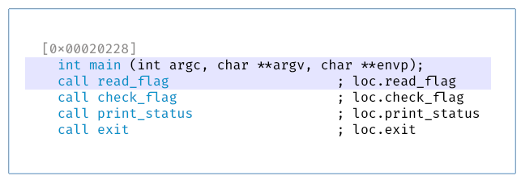
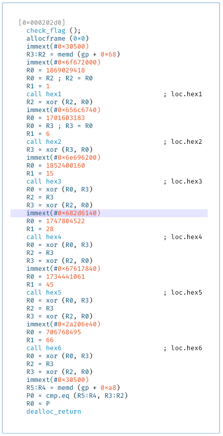
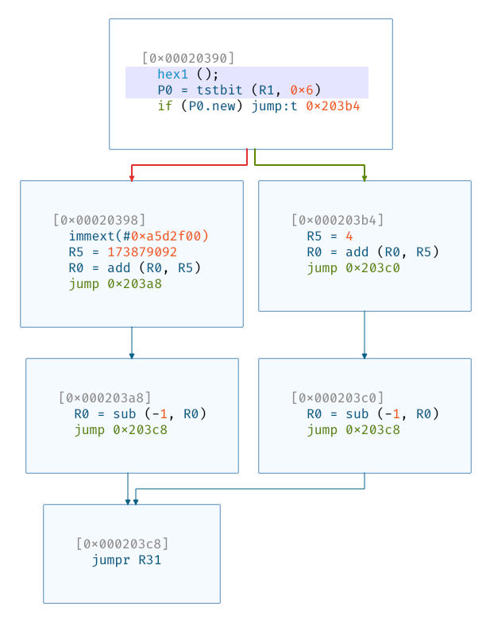
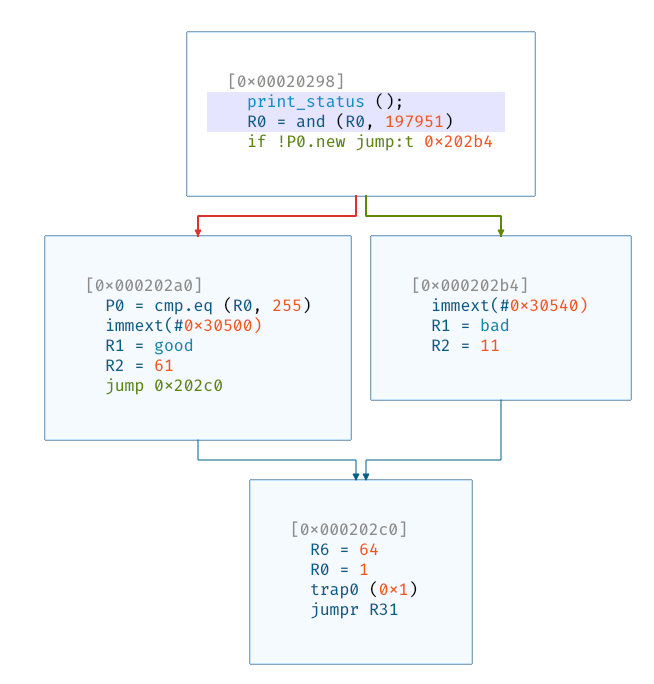
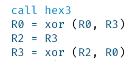

# Hexagon

**Category**: rev \
**Points**: 166 (69 solves)

\*slaps DSP\* \
This baby can fit so many instructions in its execution slots!

Attachments: `challenge`

## Overview

```
$ file challenge
challenge: ELF 32-bit LSB executable, QUALCOMM DSP6, version 1 (SYSV), statically linked, for GNU/Linux 3.0.0, with debug_info, not stripped
```

This is an executable for the Qualcomm Hexagon architecture. Ghidra doesn't
support it, but [Cutter](https://cutter.re/) does. After opening it, we see a
very simple `main` function:



`read_flag` just reads 8 characters from `stdin`.

`check_flag` checks the flag and calls six `hex` functions.



> If you check the solve script in `solve.py`, you can see that some of the
> constants spell out `* google binja-hexagon *`, which references
> [Google's Hexagon plugin for Binja](https://github.com/google/binja-hexagon).

Each `hex` function looks something like this:



Finally the `print_status` function looks like this (two branches depending on
whether the flag is correct):



## Solution

I'm not familiar with the Hexagon architecture, so I read this
[short guide](https://github.com/programa-stic/hexag00n/blob/master/docs/intro_to_hexagon.rst)
first. I also learned that QEMU v6.0.0 released last April added support for
Hexagon, so I downloaded it and compiled it. Following this
[file](https://github.com/qemu/qemu/blob/v6.0.0/target/hexagon/README), I also
set the `HEX_DEBUG` macro to 1.

Now I could run the program:

```
$ qemu-hexagon -strace ./challenge
Hi!
240011 write(1,0x30508,4) = 4
12345678
240011 read(0,0x3050d,8) = 8
Try again!
240011 write(1,0x3055a,11) = 11
240011 exit_group(0)
```

If I used the program compiled with `HEX_DEBUG` on, it would print out every
instruction and the registers changed, which was very useful. The output looked
something like this:

```
$ qemu-hexagon-dbg -strace ./challenge
decode_packet: pc = 0x20200
    words = { 0xa09dc000, }
	allocframe(R29,#0x0):raw //slot=0:tag=S2_allocframe
Start packet: pc = 0x00020200
log_store8(0x4080e2d8, 0 [0x0160])
log_reg_write[30] = 1082188504 (0x4080e2d8)
Packet committed: pc = 0x00020200
slot_cancelled = 0
Regs written
	r29 = 1082188504 (0x4080e2d8)
	r30 = 1082188504 (0x4080e2d8)
Stores
	memd[0x4080e2d8] = 0 (0x0000000000000000)
Next PC = 00000000
Exec counters: pkt = 00000000, insn = 00000000
...
```

I saved the output to a file so that I could refer to it while reversing the
`check_flag` function.

Luckily the logic wasn't too complicated and could be replicated in Python
without too much hassle. Remember how each `hex` function had two branches? It
turns out each branch condition was determined by a constant, so no matter what
we typed, the control flow stayed the same.

This also made it easier to encode constraints with Z3, which was how I solved
it:

```
$ python3 solve.py
sat
IDigVLIW

$ qemu-hexagon ./challenge
Hi!
IDigVLIW
Congratulations! Flag is 'CTF{XXX}' where XXX is your input.
```

Flag: `CTF{IDigVLIW}`

## Note

There was a bug in how Cutter showed some of the instructions, such as here:



I initially implemented this as

```python
hex3()
R0 = R0 ^ R3
R2 = R3
R3 = R2 ^ R0
```

However, Hexagon has this thing called "packets", which group instructions
together so that they can be executed in parallel. Checking the output of
`qemu-hexagon-dbg`, we can see that these two instructions belong in the same
packet.
```
{
    R2 = R3 //slot=3:tag=A2_tfr
    R3 = xor(R2,R0) //slot=2:tag=A2_xor
}
```

So the correct implementation should be
```python
R2, R3 = R3, R2 ^ R0
```

It took me several hours to find this bug :facepalm:
