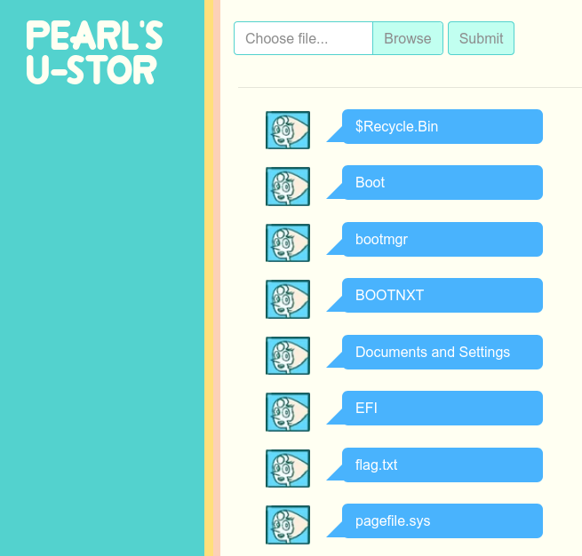

# Pearl's U-Stor

**Category**: Web \
**Points**: 240 (21 solves) \
**Author**: zaratec

## Challenge


Attachments: `pearls-ustor.tar.gz` \
Site: http://pearl.pwni.ng/

## Overview

This is a simple flask web app that allows us to upload files, which are stored
in `/tmp/<cookie_id>/`.

Unfortunately, they used `secure_filename` so we can't put weird characters in
the filepath:
```python
file_path = os.path.join(
    app.config["TMP_FOLDER"],
    secure_filename(cookie_id),
    secure_filename(myfile.filename),
)
```

However, they made a mistake that allows us to list arbitrary files:
```python
file_list = os.listdir(os.path.join(app.config["TMP_FOLDER"], cookie_id))
```

By setting our `cookie_id` to `/` we can see that the app is hosted in a Cygwin
environment, and that the flag is stored in `/cygdrive/c/flag.txt`.



However, clicking on `flag.txt` gives


because of this:
```python
if not os.path.exists(
    os.path.join(app.config["TMP_FOLDER"], secure_filename(cookie_id), filename)
):
    abort(404, description="Nothing here.")
```

## Solution

Exploit: Upload a `flag.lnk` symlink to `/cygdrive/c/flag.txt`

Walkthrough: https://youtu.be/yht7bpF0Ei0 (solved with ammar2, elnardu, and Exaphis)
