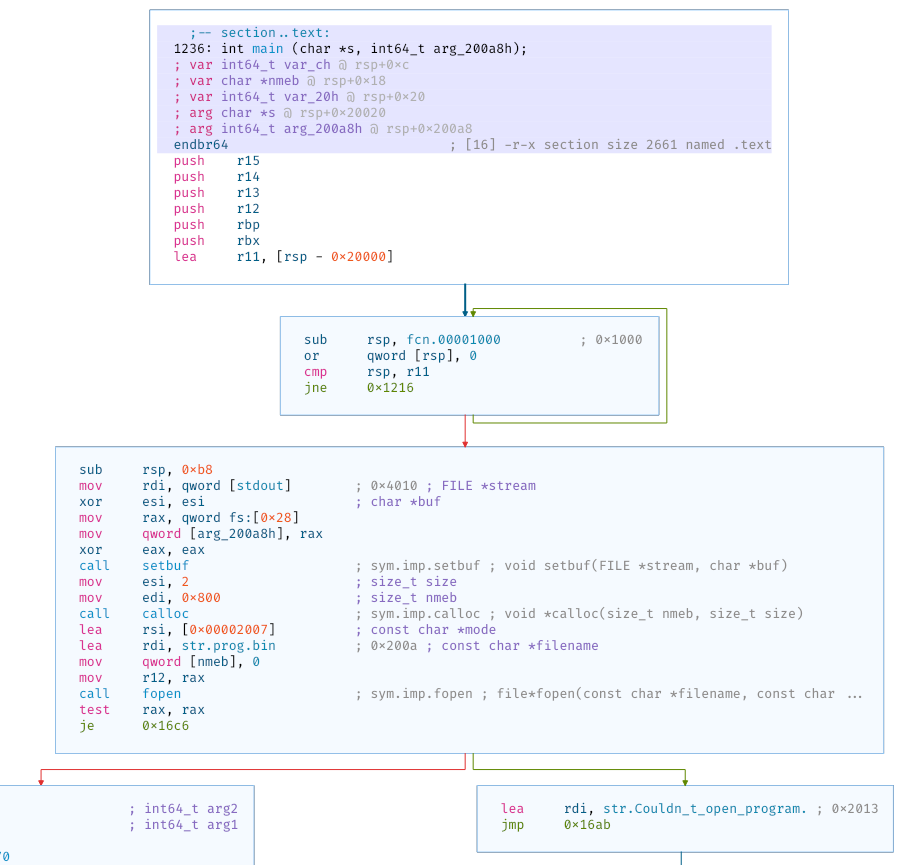
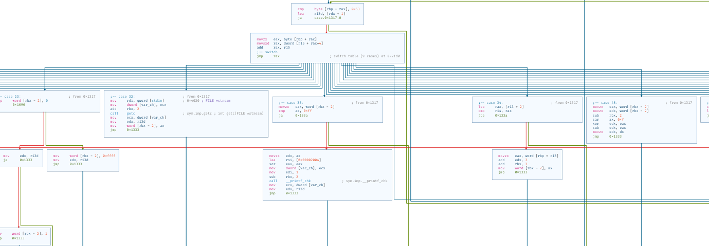

# 2k

**Category**: Rev \
**Points**: 229 points (23 solves) \
**Author**: EvilMuffinHa

```
nc mc.ax 31361
```

Attachments:
- `prog.bin`
- `chall`

## Overview

> Note: this challenge already has a several
> [write-ups](https://cor.team/posts/redpwnCTF%202021%20-%202k%20Reversing%20Challenge)
> so I won't go into too much detail.

Looks like a custom VM `chall` that runs `prog.bin`. All the logic is in
`main()`.

For this challenge I decided to use [Cutter](https://cutter.re/), since I like
its graph view and debugger. Starting at the top, we have:



Basically it calloc's a 0x800 size chunk and reads `prog.bin` into it. Next it enters a loop with a huge `switch` table:



There are about 26 switch cases, each one belonging to a opcode. After
reversing for about 3 hours, here's what I found:

- This is a stack machine (apparently there were a lot of stack machines in this CTF)
- Each word is 16 bits
- Aside from the stack, there's also a tape that can be read and written
- There are basic instructions like: `add, sub, mul, div, mod, modmul, push,
  pop, getc, print, conditional jump, ...`
- The program reads 64 chars and checks a bunch of constraints. If any of
  them fail, then it jumps to address 4, which exits the program with a
  failure.

## Solution

> Solved with robotearthpizza, jrmo14, and a0su

There were two ways to solve this:
1. Disassemble the program and feed the constraints to z3
2. Symbolic execution

Since option 2 sounded a lot cleaner, that's what I did.
- First I translated the VM to python
- Instead of feeding in actual characters, I fed it `z3.BitVecs`
- At each conditional jump, I collected the constraints and added them to the solver.
- When the program finished, I used the z3 model evaluate the input and print
  out a password that passed all constraints

But that was easier said than done. I spent hours about 6 hours fixing bugs and
fiddling with z3 to get it to work. Something that I got stuck on was `modmul`:

At first I thought `(b * c) % a` would work, but I actually had to zero extend
to 32-bits before computing the product :facepalm:

```python
a32 = z3.ZeroExt(16, a)
b32 = z3.ZeroExt(16, b)
c32 = z3.ZeroExt(16, c)

m32 = c32 * b32
res32 = z3.SRem(m32, a32)
res = z3.Extract(15, 0, res32)
```

Final script in `solve.py` (it takes about 40 seconds to run). Output:
```
0x0: push 12
0x3: goto 12
0xc: push 115
0xf: print 's'
0x10: push 105
0x13: print 'i'
0x14: push 99
...
0x2fd7: push 8
0x2fda: goto 8
0x8: push 0
0xb: exit 0
sat
+%'C!1L.)0,6 734$"!04l72425+@q9S0139,*C;69V(2.&I"6<NMK,c1A4&75u9

$ nc mc.ax 31361
sice deet:
+%'C!1L.)0,6 734$"!04l72425+@q9S0139,*C;69V(2.&I"6<NMK,c1A4&75u9
flag{kenken_is_just_z3_064c4}
```

Yay
