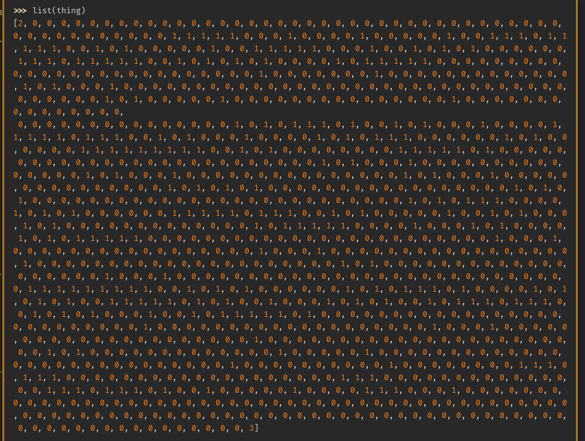

# dimensionality

**Category**: Rev \
**Points**: 144 points (69 solves) \
**Author**: EvilMuffinHa, asphyxia

The more the merrier

Attachments: `chall`

## Overview

Opened it in Ghidra but the decompilation sucked, so I switched to Cutter.

Basically the program calls a function to check the input. If it passes, it
XOR's the input with a byte-string to print the flag.

It's hard to tell what the input checker does just by looking, so this is where
using Cutter's debugger to setup through the program in graph view helped a
lot.

> Another thing that helped was running the program in
> [Qiling](https://github.com/qilingframework/qiling) and hooking several
> important addresses to dump the registers. See [debug.py](debug.py) for
> script

In short, we have this thing:



- Start at 2 and end at 3
- Can only step on the 1's
- Can only step forwards/backwards in increments of 1, 11, and 121
- Each character determines what kind of step to take
- Input must be at most 29 characters

I solved this with breadth-first search (see `solve.py`), which gave me 5 possible strings:
```
flluulluuffffrrffrrddddrrfff
fllddllffrrffffrrffuubbrrfff
fddllllffrrffffrrffuubbrrfff
frrffllllffddffrrffuubbrrfff
frrffllffllddffrrffuubbrrfff
frrffllffddllffrrffuubbrrfff
```

It was the last one:
```
$ ./chall
frrffllffddllffrrffuubbrrfff
:)
flag{star_/_so_bright_/_car_/_site_-ppsu}
```
