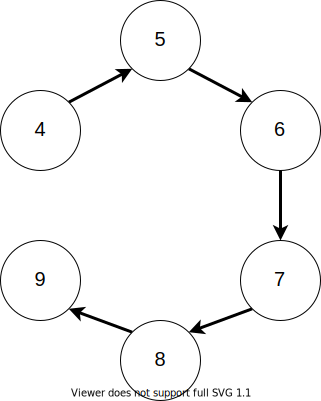

# Algorithm

**Category**: Reverse Engineering

**Points**: 994 (26 solves)

**Author**: hukc

## Challenge

**Description**: I made this well-known algorithm into a reversing problem.

**Attachments**: algorithm

## Overview

### Basic Info

```
$ file algorithm
algorithm: ELF 64-bit LSB pie executable, x86-64, version 1 (GNU/Linux), dynamically linked, interpreter /lib64/ld-linux-x86-64.so.2, BuildID[sha1]=48a3c96e612fd1fed7ce748c3e25f2982b0a0473, for GNU/Linux 4.4.0, not stripped
```

The biggest thing to note is that the binary wasn't stripped, which made reversing easier. Running strings produced a bunch of lines like this:

```
_ZNSt8_Rb_treeIiSt4pairIKiSt6vectorIiSaIiEEESt10_Select1stIS5_ESt4lessIiESaIS5_EE12_M_drop_nodeEPSt13_Rb_tree_nodeIS5_E
_ZNSt15_Deque_iteratorISt4pairIiiERS1_PS1_EC2Ev
_ZSt14__copy_move_a1ILb0EPKiPiET1_T0_S4_S3_
```

These mangled function names, in addition to `std::` in the demangled names, let me know that this is a C++ binary. While doing this write up, I also noticed a line that I missed during the CTF that would have been super helpful (you'll see why later):

`graphs.cpp`

### First Execution

I ran the binary for the first time:

```
$ ./algorithm
Input a number:
4
Input 4 pairs of numbers:
1 4
2 4
3 4
4 4
Wrong!
$
```

So the program prompts for `num_pairs`, then `num_pairs` pairs of numbers (integers specifically). With that background info, I loaded the binary into Ghidra. **Note that I have also included in this repo the adjusted decompilation output with all my variable names from Ghidra for both the [`main()`](ghidra-main.c) and [`compute()`](ghidra-compute.c) functions**.

Since the binary isn't stripped, `main` was already found. Ghidra helpfully demangled the function names to provide type info in the decompilation view, but with all the object-oriented generics the view became very cluttered. Since this is the first public write-up I've posted for a C++ reversing challenge, in the next section I point out a few code C++ code patterns that I used to understand the decompilation better. There are many other introductions to reversing C++ online, but here I only use excerpts from the challenge binary (specifically `main()` and `compute()`).

### C++ Patterns in Ghidra

#### std:: and Namespaces

```cpp
std::cin
```

`::` is the scope resolution operator. When prefixed with `std`, it indicates use of the standard library (which has [plenty](https://www.cplusplus.com/reference/) of [documentation](https://en.cppreference.com/w/) online).

Scope resolution is also commonly used to reference class member functions:

```cpp
std::vector<int,std::allocator<int>>::push_back(pvVar6,(int *)&local_440);
```

Ignoring the stuff between the `<>` for now, this line calls the `push_back` member function of the `vector` class of the standard library.

#### Operators

```cpp
std::operator<<((basic_ostream *)std::cout,"That\'s not a number\n");
```

This function, and any other function name prefixed with `operator`, indicates the use of operator overloading. The original C++ looked similar to this:

```cpp
std::cout << "That's not a number\n";
```

#### Containers

The C++ standard library includes a bunch of commonly used data structures. Looking over the challenge binary, we see the use of:

* [std::map](https://en.cppreference.com/w/cpp/container/map)
* [std::vector](https://en.cppreference.com/w/cpp/container/vector)
* [std::pair](https://en.cppreference.com/w/cpp/utility/pair)
* [std::set](https://en.cppreference.com/w/cpp/container/set)
* [std::queue](https://en.cppreference.com/w/cpp/container/queue)
* [std::deque](https://en.cppreference.com/w/cpp/container/deque)

#### Generics

C++ programmers can avoid rewriting a general algorithm for each type using templates. When using generic functions, the actual type is specified and wrapped in <> as follows:

```cpp
std::pair<int,int>::pair<int,int,true>((int *)&local_b0,(int *)&local_c8);
```

Templating can even be nested:

```cpp
local_c0 = (vector<int,std::allocator<int>> *)
    std::map<
        int,
        std::vector<
            int,
            std::allocator<int>
        >,
        std::less<int>,
        std::allocator<
            std::pair<
                int_const,
                std::vector<
                    int,
                    std::allocator<int>
                >
            >
        >
    >
    ::operator[](this,&local_e0);
```

For the purposes of reversing, generics/templating can mostly be ignored unless you need type information. Understanding this reduces the amount of code you have to look at to understand the binary.

#### (Con|De)structors

Functions with the same name as the class are constructors. Functions with the same name as the class but prefixed with `~` are destructors. So this mess which takes up 2 lines in Ghidra:

```cpp
      std::__cxx11::basic_string<char,std::char_traits<char>,std::allocator<char>>::~basic_string
                ((basic_string<char,std::char_traits<char>,std::allocator<char>> *)local_1c8);
```

just destroys the `basic_string` at `local_1c8`.

#### `this` Pointer

Calling member functions on C++ objects makes use of an implicit `this` pointer which typically [isn't shown in the function prototype in documentation](https://www.cplusplus.com/reference/queue/queue/pop/) but shows up as the first parameter in Ghidra. For example, the following decompilation output:

```cpp
      std::
      queue<std::pair<int,int>,std::deque<std::pair<int,int>,std::allocator<std::pair<int,int>>>>::
      pop(local_78);
```

roughly correlates to:

```cpp
local_78.pop();
```

#### Operator Chaining

The below code keeps using the stream insertion operator (`operator<<`) with `pbVar5` and storing the result in `pbVar5`:

```cpp
  pbVar5 = std::operator<<((basic_ostream *)std::cout,"Input ");
  pbVar5 = (basic_ostream *)
           std::basic_ostream<char,std::char_traits<char>>::operator<<
                     ((basic_ostream<char,std::char_traits<char>> *)pbVar5,local_458);
  std::operator<<(pbVar5," pairs of numbers:\n");
```

`operator<<` expects a `std::basic_ostream` as its first parameter, which it also returns, allowing chaining. The original code for the above was something like the following:

```cpp
cout << "Input " << local_458 << " pairs of numbers:\n");
```

#### Iterators

C++ uses iterators to loop over items. Usually the `begin()` and `end()` member functions of classes return an iterator pointing to the first and last element of the container respectively and `operator++` advances an iterator. Seeing these functions used like below:

```cpp
    local_d0 = std::vector<int,std::allocator<int>>::begin(local_c0);
    local_c8 = std::vector<int,std::allocator<int>>::end(local_c0);
    while (bVar2 = __gnu_cxx::operator!=
                             ((__normal_iterator *)&local_d0,(__normal_iterator *)&local_c8),
          bVar2 != false) {
      piVar4 = (int *)__gnu_cxx::__normal_iterator<int*,std::vector<int,std::allocator<int>>>::
                      operator*((__normal_iterator<int*,std::vector<int,std::allocator<int>>> *)
                                &local_d0);
      local_dc = *piVar4;
      local_d8 = local_d4 + 1;
      std::pair<int,int>::pair<int&,int,true>((pair<int,int> *)&local_b0,&local_dc,&local_d8);
      std::
      queue<std::pair<int,int>,std::deque<std::pair<int,int>,std::allocator<std::pair<int,int>>>>::
      emplace<std::pair<int,int>>(local_78,(pair *)&local_b0);
      __gnu_cxx::__normal_iterator<int*,std::vector<int,std::allocator<int>>>::operator++
                ((__normal_iterator<int*,std::vector<int,std::allocator<int>>> *)&local_d0);
    }
```

represents iterating over a container (with some logic inside the loop too).

#### Missing Parameters

This aspect isn't C++ specific but it showed up in this binary so I wanted to include it here. Take the following code:

```cpp
      plVar3 = (long *)std::
                       queue<std::pair<int,int>,std::deque<std::pair<int,int>,std::allocator<std::pair<int,int>>>>
                       ::front();
```

`std::queue::front()` should have the implicit `this` parameter but we don't see one. The solution is to check the corresponding listing (disassembly) output:

```asm
        00102437 48 8d 45 90     LEA        RAX=>local_78,[RBP + -0x70]
        0010243b 48 89 c7        MOV        param_1,RAX
        0010243e e8 83 13        CALL       std::queue<std::pair<int,int>,std::deque<std::   undefined front(void)
                 00 00
```

Per the System V ABI (since this binary is an ELF), the first parameter should be placed in `rdi`/`edi`, and hovering over `param_1` shows us exactly that, so the parameter for `front()` is `rbp - 0x70`. This example just goes to show you that decompilation output isn't perfect and you should consider the assembly to be closer to ground truth (though it could also be incorrect!).

### General Program Flow

Applying the above C++ knowledge made it a lot easier to quickly see what actually mattered. Before analyzing more intensely, a quick glance showed the general structure of `main()`:
* read in user input strings and parse pairs of numbers from the strings
* construct a `map<int, vector<int>>` based on the input pairs
* pass the map to `compute()`
* if the call to `compute()` is non-zero, pull pairs out of the map and use them to generate a string
* pass the string to `SHA1()`
* XOR the SHA1 hash and output as a string

This binary makes heavy use of data structures, which made sense because it allegedly implements some algorithm. Since I didn't immediately recognize it, I set about trying to figure out how exactly the map is built from input and what map to pass to `compute()` to get it to return a non-zero value.

### A Deeper Look

#### `map` Building

The binary:
* uses `getline()` to read a string and `std::basic_istream` with `std::operator>>` to either parse an int (which I called `num_pairs`) or fail out
* creates a `map<int, vector<int>>` which I called `pair_map`
* loops `num_pairs` times:
    * again uses `getline()` and `std::basic_stream` with `std::operator>>`, this time to read 2 integers (which I called `num_key` and `num_val`) or fail out
    * if `pair_map[num_key]` doesn't exist yet, assigns it to an empty `vector<int>`
    * if `pair_map[num_val]` doesn't exist yet, assigns it to an empty `vector<int>`
    * adds `num_val` to the `pair_map[num_key]` vector
    * adds `num_key` to the `pair_map[num_val]` vector

So if I entered:

```
$ ./algorithm
Input a number:
5
Input 5 pairs of numbers:
1 2
2 3
2 4
3 4
4 5
Wrong!
$
```

it made:

| Key | Value Vector |
|:---:|:-------------|
| 1   | < 2 >        |
| 2   | < 1, 3, 4 >  |
| 3   | < 2, 4 >     |
| 4   | < 2, 3, 5 >  |
| 5   | < 4 >        |

After a while of staring at this code and `compute()`, it slowly dawned on me that the code is creating an [adjacency list](https://en.wikipedia.org/wiki/Adjacency_list)! An adjacency list is a common way to store a graph. This is the part where noticing `graphs.cpp` would have saved a bit of time. Regardless, realizing this made me realize that `compute()` is implementing some sort of graph algorithm, and I had to provide a graph with a certain structure to pass the check.

#### The `compute()` Check

Now that I had a semantic understanding of the map and its values, figuring out `compute()` was much faster. The function creates a set, queue, and hardcoded first key/value pair `(4, 0)` which gets added to the queue. The data structures are then used as follows:
* pairs which I denote `(curr_key, curr_val)` are removed from the queue until one is found which isn't already in the set
* every `curr_mapval_vec_val` in the vector `pair_map[curr_key]` is added to the queue as pair `(curr_mapval_vec_val, curr_val + 1)`

If that process sounds familiar, that's because this function implements Breadth-First Search! The map is the adjacency list, the queue indicates upcoming nodes to visit, and the set contains already-visited nodes. The value which gets incremented by 1 every iteration of the loop is the cost to reach nodes! That means each pair is (node_#, node_cost).

Some of this reversing was made more confusing by the compiler's reuse of the same stack area for different purposes in different parts of the function, which I haven't quite figured out how to label cleanly yet.

## Solution

Now that I understood the data structure and the algorithm, I just had to figure out the structure of the graph that would pass the additional checks. The main loop in `compute()` exits in 3 cases:
* returns failure if the node_# is ever not equivalent to (node_cost + 4)
* returns success if the queue becomes empty when (set size == map size == 6)
* returns failure if the queue becomes empty otherwise

The check for node_# == (node_cost + 4) confused me for a bit until I remembered that the first node is node 4 with cost 0. This check basically ensures that the nodes must be found in order of their numbering, i.e. node 5 must come next with cost 1, node 6 must come after that with cost 2, etc. This means the structure of the graph is just a boring line. Since the size of the map is the number of lists (`std::vector`s) in the adjacency list, there must be 6 nodes in this line.

The following graph passes all the checks:



The adjacency list for this graph is:

| Node | Connected Nodes|
|:----:|:---------------|
| 4    | 5              |
| 5    | 4, 6           |
| 6    | 5, 7           |
| 7    | 6, 8           |
| 8    | 7, 9           |
| 9    | 8              |

I entered the edges to the program as follows to get the flag:

```
$ ./algorithm
Input a number:
5
Input 5 pairs of numbers:
4 5
5 6
6 7
7 8
8 9
utflag{graphs_lol}
$
```

It's important to note that while the order of the two nodes in each edge doesn't matter, the order of the edges DOES matter. In other words, this still produces the flag:

```
$ ./algorithm
Input a number:
5
Input 5 pairs of numbers:
5 4
5 6
6 7
8 7
9 8
utflag{graphs_lol}
$
```

while this passes the checks but outputs an incorrect flag:

```
$ ./algorithm
Input a number:
5
Input 5 pairs of numbers:
4 5
6 7
5 6
7 8
8 9
4\7!>Xu3d3
$
```
