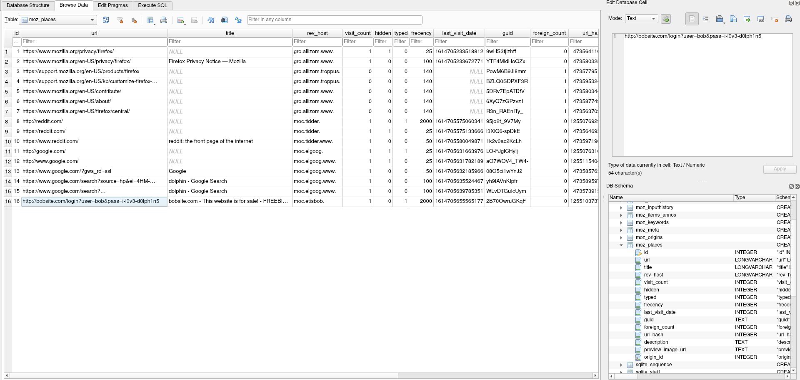
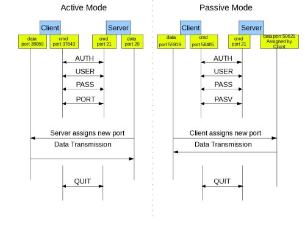
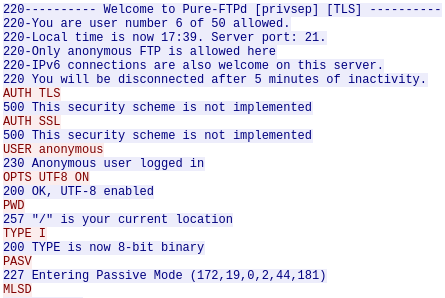

# Hack Bob's Box

**Category**: Networking

**Points**: 930 (85 solves)

**Author**: mattyp

## Challenge

**Description**: 

Hack Bob's box!

nmap is allowed for this problem only. However, you may only target misc.utctf.live:8121 and misc.utctf.live:8122 with nmap.

**Attachments**: bobs-ftp.tar

## Overview

The description gives us a pair of ports and an address. Let's nmap it with the `-A` flag so we get everything (OS detection, version detection, script scanning, and traceroute).

```
$ sudo nmap -v -A -p 8121-8122 misc.utctf.live
Starting Nmap 7.91 ( https://nmap.org ) at 2021-04-01 11:25 EDT
... OUTPUT SNIPPED ...
Nmap scan report for misc.utctf.live (3.236.87.2)
Host is up (0.081s latency).
Other addresses for misc.utctf.live (not scanned): 2607:7700:0:23:0:1:3ec:5702
rDNS record for 3.236.87.2: ec2-3-236-87-2.compute-1.amazonaws.com

PORT     STATE SERVICE VERSION
8121/tcp open  ftp     Pure-FTPd
| ftp-anon: Anonymous FTP login allowed (FTP code 230)
|_Can't get directory listing: PASV IP 172.19.0.2 is not the same as 3.236.87.2
8122/tcp open  ssh     OpenSSH 7.6p1 Ubuntu 4ubuntu0.3 (Ubuntu Linux; protocol 2.0)
| ssh-hostkey: 
|   2048 31:84:d1:43:41:53:48:71:50:6a:91:51:13:a9:97:88 (RSA)
|   256 48:00:d0:e3:0f:53:d5:d2:42:0a:be:0d:69:d1:5f:ba (ECDSA)
|_  256 99:0f:41:82:b1:ce:3b:06:6c:ab:55:c5:46:e7:c2:a7 (ED25519)
Warning: OSScan results may be unreliable because we could not find at least 1 open and 1 closed port
Device type: general purpose
Running (JUST GUESSING): Linux 4.X|5.X (85%)
OS CPE: cpe:/o:linux:linux_kernel:4 cpe:/o:linux:linux_kernel:5
Aggressive OS guesses: Linux 4.15 - 5.6 (85%)
No exact OS matches for host (test conditions non-ideal).
Uptime guess: 28.098 days (since Thu Mar  4 08:05:40 2021)
Network Distance: 6 hops
TCP Sequence Prediction: Difficulty=261 (Good luck!)
IP ID Sequence Generation: All zeros
Service Info: OS: Linux; CPE: cpe:/o:linux:linux_kernel

TRACEROUTE (using port 80/tcp)
HOP RTT       ADDRESS
1   125.78 ms 192.168.238.11
2   72.97 ms  255.0.0.0
3   ...
4   73.00 ms  255.0.0.1
5   73.00 ms  255.0.0.2
6   73.00 ms  ec2-3-236-87-2.compute-1.amazonaws.com (3.236.87.2)

NSE: Script Post-scanning.
Initiating NSE at 11:26
Completed NSE at 11:26, 0.00s elapsed
Initiating NSE at 11:26
Completed NSE at 11:26, 0.00s elapsed
Initiating NSE at 11:26
Completed NSE at 11:26, 0.00s elapsed
Read data files from: /usr/bin/../share/nmap
OS and Service detection performed. Please report any incorrect results at https://nmap.org/submit/ .
Nmap done: 1 IP address (1 host up) scanned in 55.38 seconds
           Raw packets sent: 90 (8.784KB) | Rcvd: 66 (5.028KB)
$
```

So these services are FTP and SSH at their [well-known port numbers](https://en.wikipedia.org/wiki/List_of_TCP_and_UDP_port_numbers) plus 8000, which is a common numbering strategy. Without any usernames/passwords/keys for SSH yet, let's try FTP. Two lines from the nmap output stand out:

```
| ftp-anon: Anonymous FTP login allowed (FTP code 230)
|_Can't get directory listing: PASV IP 172.19.0.2 is not the same as 3.236.87.2 ```
```

The first line tells us that anonymous access is allowed (i.e. we don't have to know credentials in order to connect), and the second seems to be telling us that the server is providing an invalid address. 3.236.87.2 is the IP address we get for misc.utctf.live, but 172.19.0.1 is a [private address](https://en.wikipedia.org/wiki/Private_network) since it is within the range 172.16.0.0-172.31.255.255. I tried connecting with FileZilla but got an error. I didn't record the exact error and assumed it had something to do with the private address. At this point during the actual competition I got distracted by a lead on another challenge and by the time I came back the author added the files which were on the FTP server as an attachment so I used those to solve. After the competition I came back and analyzed the FTP server aspect, which I cover at the [end of this post](#revisiting-ftp), but first I'll describe the solve using the attachment.

## Solution

After extracting, we see the tarball contains 4 directories (2 of which are hidden):

```
$ tar -xf ./bobs-ftp.tar
$ ls -al ./bobs-ftp/
total 24
drwxr-xr-x 6 orville orville 4096 Mar 13 16:48 .
drwxr-xr-x 3 orville orville 4096 Apr 16 17:52 ..
drwxr-xr-x 2 orville orville 4096 Apr 16 17:52 docs
drwxr-xr-x 2 orville orville 4096 Mar 13 16:37 favs
drwxr-xr-x 3 orville orville 4096 Apr 16 17:52 .mozilla
drwxr-xr-x 2 orville orville 4096 Apr 16 17:52 .ssh
$
```

The favs folder includes 3 dolphin pictures, including 1 letting us know to look someplace else because this is a red herring :)


The docs folder includes some funny texts from Bob:

letter.txt

```
Dear RobinHood employee,

As a user of your application, I was extremely disappointed to 
find out that your platform had colluded with Citadel Securities 
to protect their interests in shorting $GME. I had a considerable 
amount of my life savings invested in this stock, and now I am 
having to make difficult decisions about how to pay rent this 
month. Hopefully you can appreciate the difficulty that you have 
caused me and reinstate my account so I can sell my remaining 
shares.

Best,
Bob Bobberson
```

notes.md

```
# 1/3/2021 Group Meeting

## Georgia's project
- something about APIs ???
- apparently, I have to do something with some newfangled language called Rust >:(

## Security team
- don't click on those emails that say you won a new laptop
  - even if they say you're the millionth visitor
- rain on my parade more, why don't you

## My presentation
- seemed like people responded really well
  - silence means everyone understood I think
```

todo.txt

```
-------------------------------
|       Bob's TODO List       |
-------------------------------
-text jeff about gme
-think of a bday gift for tom
-sell my gme stocks
-look up how to sell organs
-figure out what a short is
-check my website is secure
```

The .ssh folder looks promising, especially since it contains an `id_rsa` and `id_rsa.pub`! These are the default filenames for private and public SSH keys. Pubkeys usually contain a comment with the user and host of the machine it was generated on, so let's see if we can get a username from that:

```
ssh-rsa AAAAB3NzaC1yc2EAAAADAQABAAABgQCxfP5AJNl4afX3QFRBF19E6rVCbL+9fNXEt6P3JUU396GM0uSi4TAlO3xQg2o6fbPAPdAWYzmMAmhsPJ1d7W3So8sQLRuiADLs7rlGLI3WvE0k6NswC/P0B2DYQ0yn0GBO4j9OXITnfKlWbNhh6RCGp30nEtncqYR0wZGgMxPywZxOCLYIX0Tn+63JrJOZ7SAv/v2w9TYY+HVy0t8Qi7wIFv33uIKsa6ov4jMLl8uwRPqDWTh5S3d1cMhHcIF0wyP9f5eR70Xz1cCRHb7KwVJiwuQvGLCzUAcgn6j0peRbc2fGg9RCiCYB/7mjsX1oisMoheRTTsPc84a3ewC8AHDIj32zKgzPg1iLeXtrfAtGQCAgizUerU8nUKZX1kTei2M4dnRUMj6npQ9MXIgVXUbFJeCo5xLUjrhJb9gXZ9kVx7n29M28JwJh3oCbfmwczAbCgmIyvF8rwpXEiH+eTxJG29H6QuhgQ+DR6+DYPtN//EfXNg2d94vP6adXNezphxM= matthewp@streetpizza.attlocal.net
```

Hmm, not Bob. Trying to connect with the matthewp user and the provided `id_rsa` private key doesn't work. Another red herring. Let's check out the .mozilla folder:

```
$ tree .mozilla
.mozilla
└── firefox
    └── yu85tipn.bob
        ├── addons.json
        ├── addonStartup.json.lz4
        ├── cert9.db
        ├── compatibility.ini
        ├── containers.json
        ├── content-prefs.sqlite
        ├── cookies.sqlite
        ├── extension-preferences.json
        ├── extensions.json
        ├── favicons.sqlite
        ├── formhistory.sqlite
        ├── handlers.json
        ├── key4.db
        ├── permissions.sqlite
        ├── pkcs11.txt
        ├── places.sqlite
        ├── places.sqlite-shm
        ├── places.sqlite-wal
        ├── prefs.js
        ├── protections.sqlite
        ├── search.json.mozlz4
        ├── sessionCheckpoints.json
        ├── sessionstore.jsonlz4
        ├── shield-preference-experiments.json
        ├── SiteSecurityServiceState.txt
        ├── storage.sqlite
        ├── times.json
        ├── webappsstore.sqlite
        └── xulstore.json

2 directories, 29 files
$ 
```

The `yu85tipn.bob` folder is a [Firefox profile](https://support.mozilla.org/en-US/kb/profiles-where-firefox-stores-user-data). Firefox profiles contain lots of information and settings for a browser, but based off of this line from Bob's todo:

```
-check my website is secure
```

we might want to check the history to see where Bob has been. History is stored in the `places.sqlite` file, which I opened with `sqlitebrowser`. Clicking on "Browse Data" then selecting "moz_places" from the "Table" dropdown shows Bob's browsing history:



We can see that Bob has failed to make his website secure because he sends his username and password via query parameters. Connecting to the SSH server with these credentials lets us find the flag file:

```
$ cat /flag.txt
utflag{red_teams_are_just_glorified_password_managers}
$ 
```

## Revisiting FTP

After the competition, I wanted to investigate the FTP connection, and this time was able to connect to the server successfully during testing. While this could be because the challenge author changed the server, I think what I did wrong the first time was literally type "Anonymous" for the user instead of leaving it blank to log in anonymously. So why did the connection work even though I still got `Status:	Server sent passive reply with unroutable address. Using server address instead`? To answer this, we need to look at how the File Transfer Protocol (FTP) works. FTP actually uses two ports on each host: a port for commands and a port for data. Additionally, there are two modes which determine how the connection between data ports is established using the already-established command connection: passive and active. As the below diagram ([source](https://www.mybluelinux.com/active-and-passive-ftp-simplified-understanding-ftp-ports/)) shows, the difference between these two modes is whether or not the client sends the `PASV` or `PORT` command.



I used Wireshark to packet capture a successful connection using FileZilla. Below shows the results of following the TCP Stream of the command connection:



So FileZilla is using passive mode. The server tells our client (FileZilla) that there is a socket waiting for them to connect at address 172.19.0.2, port 11445 ((44 * 256) + 181). Shortly after, Wireshark shows a connection from the client to the original server IP address (3.236.87.2) on port 11445 which connects successfully then is used for data transfer. FileZilla is smart enough to know that 172.19.0.2 is a private address, assume the server is giving out incorrect addresses because it is behind a NAT, and connect using the original address, which succeeds. Reading [this other writeup](https://blog.bi0s.in/2021/03/15/Forensics/Hack-Bob-s-Box-UTCTF21/) shows that using `PORT` to set active mode and have the server connect to the client data port also would have worked, but only if your client has a public IP or is behind a NAT which is set up with a correct port forward or Application Level Gateway (ALG).
