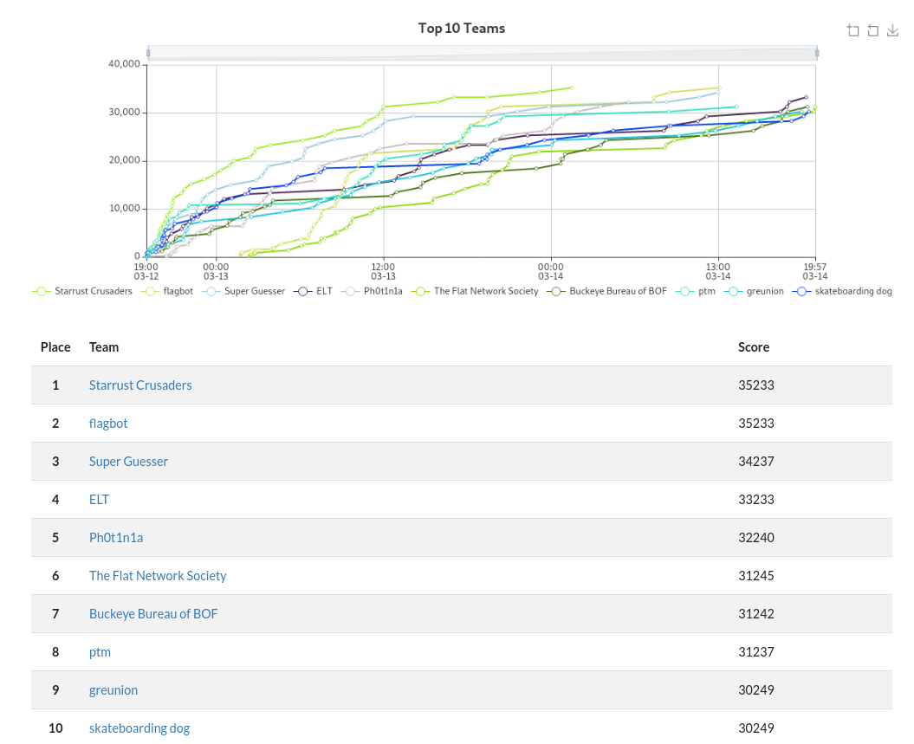

# UTCTF 2021

**CTFTime**: https://ctftime.org/event/1177 \
**Site**:  https://utctf.live \
**Rank**: 7 / 697

This was a fun medium difficulty CTF hosted by University of Texas at Austin.
We spent all weekend grinding problems and managed to solve all but 5.
Unfortunately The Flat Network Society passed us in the last two minutes and
stole 6th place from us by 3 points :(

