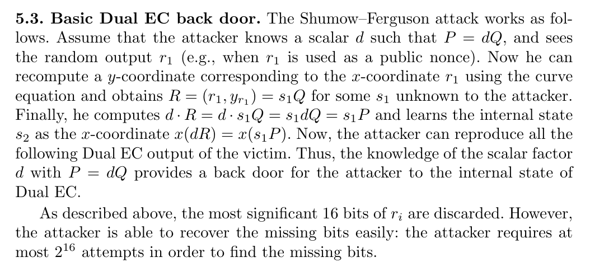

# Sleeves

**Category**: Pwn \
**Points**: 990 (34 solves) \
**Author**: hukc

## Challenge

I like putting numbers up my sleeves. To make sure I can fit
a lot of them, I keep the numbers small.

Attachments: `sleeves.tar.gz`

## Overview

We're given a simple script that encrypts the flag using a pseudorandom key.
The goal is to find this key in order to decrypt the flag.

```python
from challenge.eccrng import RNG
from Crypto.Cipher import AES
from Crypto.Hash import SHA256

rng = RNG()
# I'll just test it out a few times first
print("r1 = %d" % rng.next())
print("r2 = %d" % rng.next())

r = str(rng.next())
aes_key = SHA256.new(r.encode('ascii')).digest()
cipher = AES.new(aes_key, AES.MODE_ECB)
print("ct = %s" % cipher.encrypt(b"????????????????????????????????????????").hex())
```

Here's `eccrng.sage` (annotated by me):
```sage
from random import randint

class RNG:
    def __init__(self):
        # This elliptical curve is NIST P-256, a well-known curve that should
        # be unexploitable.
        p = 115792089210356248762697446949407573530086143415290314195533631308867097853951
        b = 0x5ac635d8aa3a93e7b3ebbd55769886bc651d06b0cc53b0f63bce3c3e27d2604b
        self.curve = EllipticCurve(GF(p), [-3,b])

        # These are the generator points for the PRNG.
        self.P = self.curve.lift_x(110498562485703529190272711232043142138878635567672718436939544261168672750412)
        self.Q = self.curve.lift_x(67399507399944999831532913043433949950487143475898523797536613673733894036166)

        self.state = randint(1, 2**256)

    def next(self):
        # In elliptical curve cryptography, scalar multiplication is a trapdoor
        # function.
        # This means that recovering `self.state` from `self.P` and `sP` is infeasible.
        sP = self.state * self.P
        r = Integer(sP[0])
        self.state = Integer((r*self.P)[0])
        rQ = r*self.Q
        # Though we lose 8 bits of rQ, 2**8 is easily bruteforceable
        return Integer(rQ[0])>>8
```

## Solution

I'm pretty new to elliptical curve cryptography, so I had to do a significant
amount of googling. Luckily, I stumbled on this: [Dual_EC_DRBG backdoor: a
proof of concept](https://blog.0xbadc0de.be/archives/155).

Unfortunately the LaTeX rendering on that site is broken and the formulas
extremely hard to read, so I found [this paper](https://www.projectbullrun.org/dual-ec/documents/dual-ec-20150731.pdf) instead.

Here is the relevant section:


So all we need to do is find `d` such that `P = d * Q`. Let's try it:
```sage
$ sage
┌────────────────────────────────────────────────────────────────────┐
│ SageMath version 9.0, Release Date: 2020-01-01                     │
│ Using Python 3.8.5. Type "help()" for help.                        │
└────────────────────────────────────────────────────────────────────┘
sage: p = 115792089210356248762697446949407573530086143415290314195533631308867097853951
sage: b = 0x5AC635D8AA3A93E7B3EBBD55769886BC651D06B0CC53B0F63BCE3C3E27D2604B
sage: E = EllipticCurve(GF(p), [-3, b])
sage: P = E.lift_x(110498562485703529190272711232043142138878635567672718436939544261168672750412)
sage: Q = E.lift_x(67399507399944999831532913043433949950487143475898523797536613673733894036166)
sage: Q.discrete_log(P)
173
```

Nice, Sage managed to calculate the `discrete_log` in 2 seconds!

Now all we have to do is implement the attack described in the paper. The only twist is that the lower 8 bits of `r1` and `r2` were discarded, but we can just bruteforce those 8 bits.

Here's my complete script
```sage
from Crypto.Cipher import AES
from Crypto.Hash import SHA256

"""
This is a Dual_EC_DRBG backdoor solver.
https://en.wikipedia.org/wiki/Dual_EC_DRBG
"""

# This elliptical curve is NIST P-256
p = 115792089210356248762697446949407573530086143415290314195533631308867097853951
b = 0x5AC635D8AA3A93E7B3EBBD55769886BC651D06B0CC53B0F63BCE3C3E27D2604B
E = EllipticCurve(GF(p), [-3, b])

# These are the generator points for the PRNG.
P = E.lift_x(
    110498562485703529190272711232043142138878635567672718436939544261168672750412
)
Q = E.lift_x(
    67399507399944999831532913043433949950487143475898523797536613673733894036166
)

# Surprisingly this works and returns 173. I guess the backdoor is pretty weak.
# This value allows us to completely break the PRNG (i.e. we can accurately
# predict returned values and states).
d = Q.discrete_log(P)


def do_next(s):
    """
    This is essentially the RNG.next() function.
    Given state `s`, return pseudorandom value `r` and the new state `s_new`.
    """
    sP = s * P
    r = Integer(sP[0])
    s_new = Integer((r * P)[0])
    rQ = r * Q
    return Integer(rQ[0]), s_new


def do_guess(r1):
    """
    Given a guess for a value `r1` return from the PRNG, determine the next
    random value as well as the state after that.
    """

    # Check if `r1` is a valid x coordinate on the curve
    try:
        rQ1 = E.lift_x(r1)
    except ValueError:
        return None

    sP2 = d * rQ1
    s2 = Integer(sP2[0])
    r2, s3 = do_next(s2)
    return r2, s3


def decrypt(r):
    """
    Decrypt the ciphertext from the challenge.
    """
    ct = bytes.fromhex(
        "c2c59febe8339aa2eee1c6eddb73ba0824bfe16d410ba6a2428f2f6a38123701"
    )
    aes_key = SHA256.new(str(r).encode("ascii")).digest()
    cipher = AES.new(aes_key, AES.MODE_ECB)
    pt = cipher.decrypt(ct)
    print(pt)


# These are the random values returned from the PRNG.
r1 = 135654478787724889653092564298229854384328195777613605080225945400441433200
r2 = 16908147529568697799168358355733986815530684189117573092268395732595358248

# Bruteforce the lower 8 bits until we guess the full value of `r1`. If our
# guess is correct, the predicted value will match r2.
for i in range(2 ** 8):
    r1_guess = (r1 << 8) + i
    guess = do_guess(r1_guess)

    if guess:
        r2_guess, s3 = guess
        if r2_guess >> 8 == r2:
            r3, s4 = do_next(s3)
            decrypt(r3 >> 8)
            break
```

Output:
```
$ sage solve.sage
b'utflag{numbers_up_my_sl33v3_l0l}'
```
