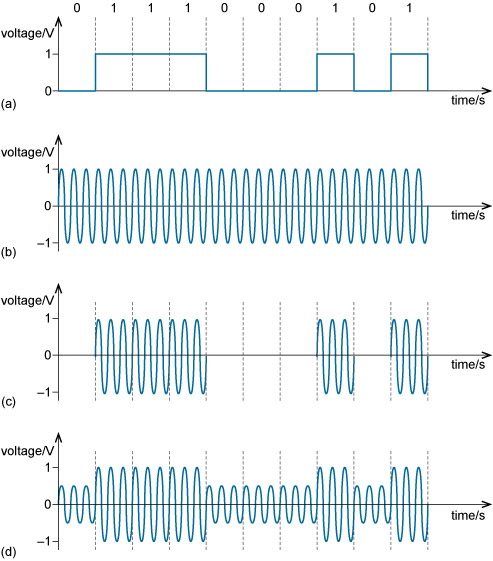
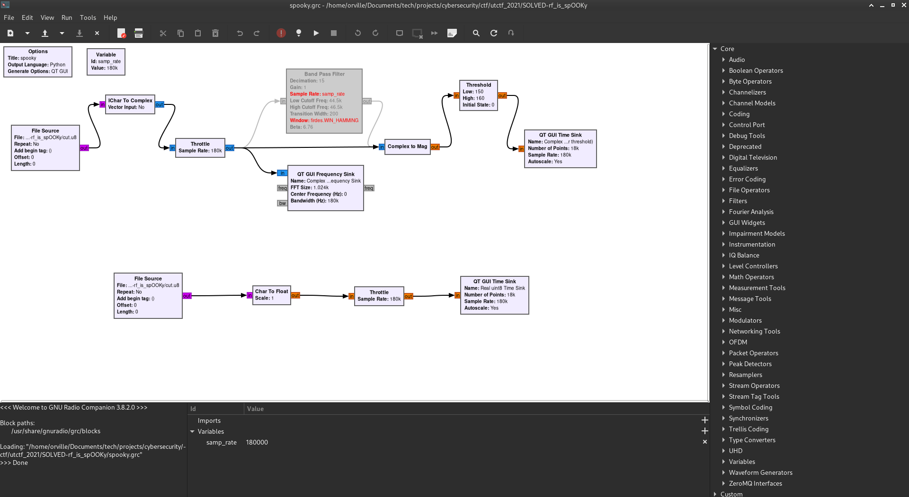
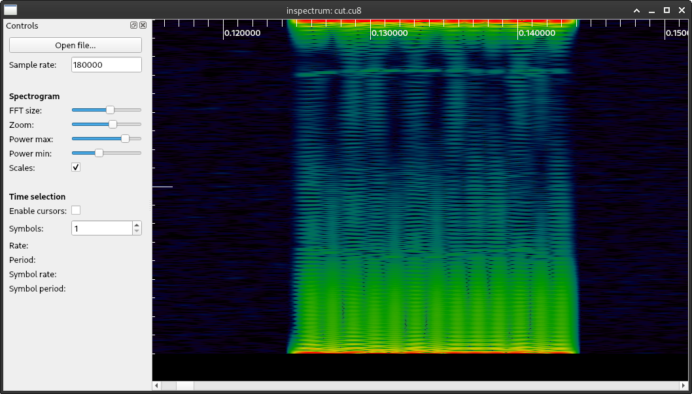
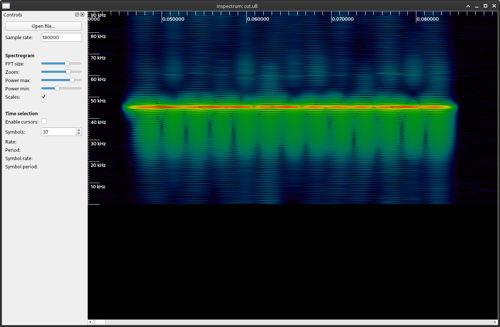
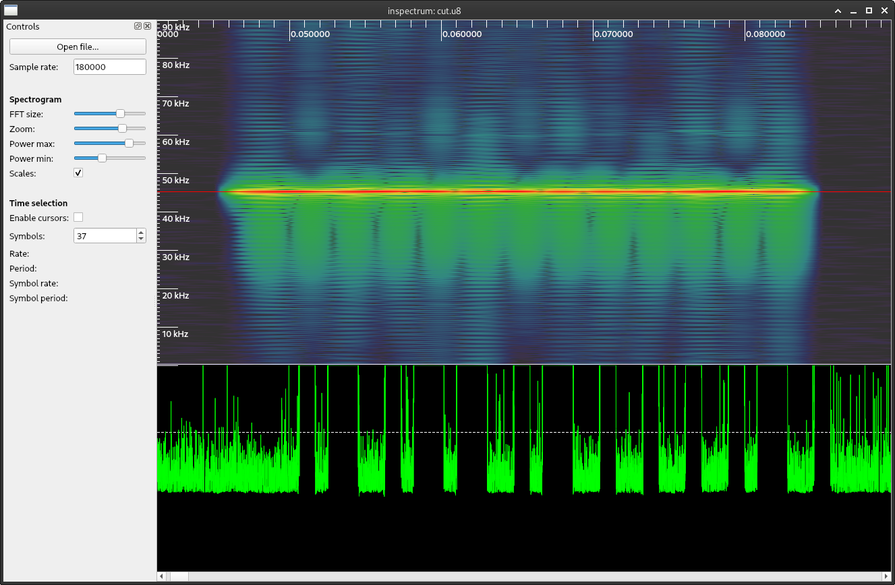
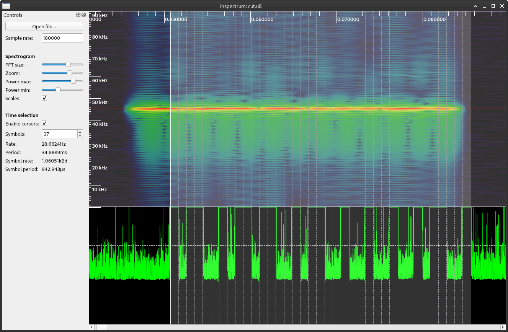
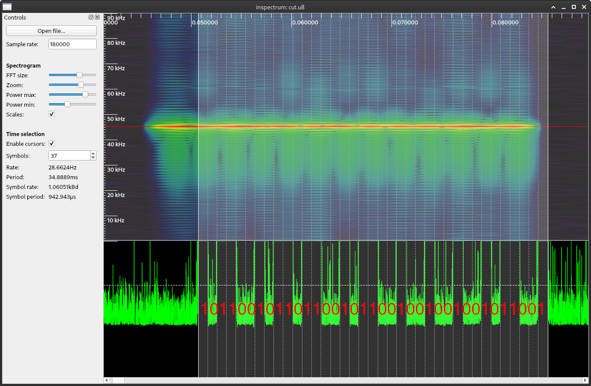
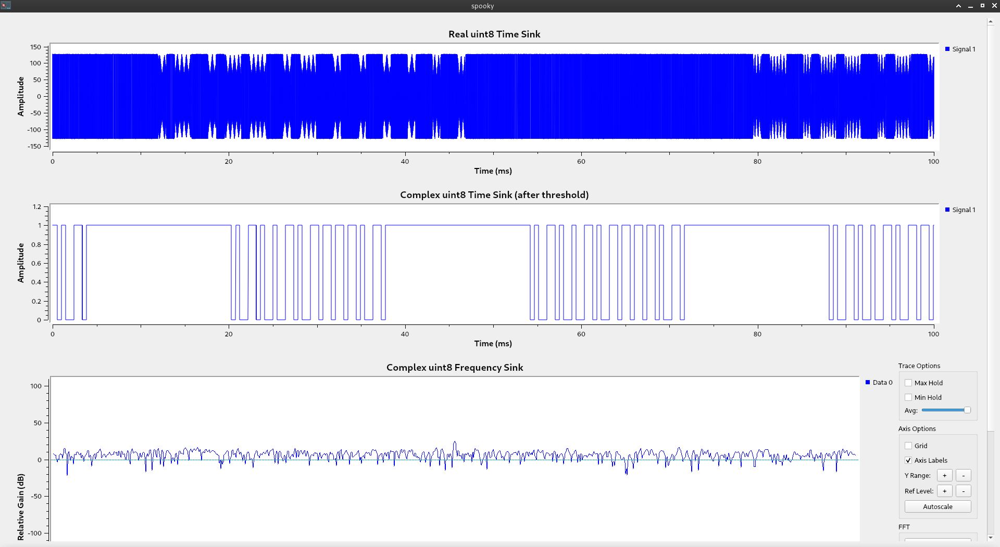

# rf is spOOKy

**Category**: Miscellaneous

**Points**: 996 (21 solves)

**Author**: Dan

## Challenge

**Description**: ACME corp has contracted you to figure out how to demodulate a secret RF signal recorded with an rtl-sdr. They have recorded many identical bursts, but your job is to demodulate one of them.
Flag format: utflag{DEMODULATED_BITSTREAM} where DEMODULATED_BITSTREAM is the actual 37 bits that were transferred over the air. file format: sample rate = 180000hz , sample type = unsigned 8-bit

**Attachments**: off.iq

## Overview

If you've worked with RF (radio frequency) before, this is a pretty straightforward challenge. If you haven't, fear not, this is a good introduction!

RF challenges typically involve trying to decode data which has been transmitted via electromagnetic waves. There are multiple ways to use a wave to transmit data, which are referred to as different modulation types. Much of the math for modulation relies on the fact that waves can be expressed as a sum of cosine/sine waves. The general process for decoding data from an unknown signal is:
- figure out which modulation was used
- figure out any parameters used for modulation
- undo the modulation (aka demodulate) to get bits (or continuous data)
- figure out the meaning/encoding of those bits

Thankfully the challenge description gives us lots of information already, even if we don't understand it all yet. We know that the sample rate is 180 khz, the sample type is 8-bit unsigned, and each burst is 37 bits long. The challenge also says that we can just submit the raw bits, so we don't have to complete the last step of the above process. Additionally, the challenge name gives a hint: the letters "OOK" in the middle of "spOOKy" are capitalized. The first result from a google search for "OOK radio frequency" is a wikipedia article about [on-off keying](https://en.wikipedia.org/wiki/On%E2%80%93off_keying).

On-off keying is a special case of amplitude modulation, where you communicate a value by adjusting the amplitude of the wave you transmit according to that value. For OOK, you only transmit binary data, which means the amplitude is only ever 1 or 0. Transmitting a wave with amplitude 0 is the same as not transmitting, hence the term on-off keying: when transmission is on it's a 1 and when transmission is off it's a 0. This simplicity makes OOK a relatively easy modulation type to process, which in turn makes it pretty popular for low-bandwidth applications. For example, OOK is used by [E-ZPass toll booth transponders](https://github.com/kwesthaus/ez-sniff). Chart (c) in the below image shows OOK and chart (d) shows the more general case of amplitude modulation where the signal strength values don't have to be just 0 and 1 ([source](https://www.open.edu/openlearn/science-maths-technology/exploring-communications-technology/content-section-1.4)):

The recorded wave for this challenge is included in the attached file. But what does this file actually contain? The file extension is a hint; on the first page of google results for "IQ radio frequency" is the wikipedia page for [in-phase and quadrature components](https://en.wikipedia.org/wiki/In-phase_and_quadrature_components). Rather than trying to explain this topic myself, I'm going to point you to [an article by Mikael Q Kuisma](http://whiteboard.ping.se/SDR/IQ) who has already done a fantastic job. The tl;dr is that RF waves are recorded by sampling the strength of the electromagnetic spectrum really fast. Additionally, there are actually TWO data points for every sampling. For this challenge, we're told that samples are recorded as unsigned 8-bit numbers, and that 180,000 sample pairs were taken every second. That means the first byte of the attached file is the unsigned 8-bit integer I value for the first sample, the second byte is the unsigned 8-bit integer Q value for the first sample, and the first 360,000 bytes of the file make up the I and Q pairs for the first 1 second of recording.

Another useful concept when working with these challenges is signal domains. The file is given to us in the time domain since we just have a bunch of samples linearly increasing in time. However, looking at how the signal strength varies over time also allows us to plot signal strength at each frequency using the Fourier transform. This format is called the frequency domain. Graphs showing RF signals are most commonly shown in the time or frequency domain (though there are others), and it's helpful to know which one you're looking at before you try to interpret it. To gain a better understanding of this notion, I recommend you play with the interactive demos on [this page by Jez Swanson](https://www.jezzamon.com/fourier/) and [this page by Karl Sims](https://www.karlsims.com/fft.html).

## Solution

[GNU Radio](https://wiki.gnuradio.org/index.php/Main_Page) is an awesome toolkit for working with RF data. One of its tools, GNU Radio Companion (GRC), lets you process RF data by creating a flowchart of different processing "blocks". Working with RF data typically involves running the data through several steps, each one performing some mathematical function, so a data pipeline model like in GNU Radio works nicely. I created a GRC flowchart for this challenge which is included in this repo and shown below:

If you want to learn more, playing around with GRC flowcharts is a great way to learn. However, because OOK is so simple, GRC is overkill for this challenge and not how I solved it during the competition; I actually used [inspectrum](https://github.com/miek/inspectrum) 0.2.3. Opening the file as provided just shows the plot as all red. Reading the github README indicates we need to change the file extension to `.cu8`. However, I tried this, and the plot looked wrong in a different way:

Inspectrum shows a horizontal "waterfall plot" with time along the X axis, frequency along the Y axis, and signal strength based on color (warmer colors = stronger signal). The "hot" part of the signal was split between the very top and very bottom frequencies, when they should be joined somewhere in the middle. During the competition I tried changing the file extension to `.cs8` and `.u8`, and `.u8` looked the best (after making sure to adjust the sliders under the "Spectogram" section), so I just assumed that I was wrong and the file only provided 1 data point per sample instead of 2 (i.e. just the real value instead of the complex value). However, in the GRC flowchart I made after the competition there are 2 pipelines for the file, 1 for real samples and 1 for complex samples. Only the one assuming complex samples produces clean output, so I think this is actually a bug with inspectrum and I'm right about the samples being complex. Regardless, if you change the extension to `.u8`, open in inspectrum, scroll the file and play with the sliders, you should eventually find a section which looks like this:

This bright area is the transmission we need to decode! Ideally it would show up as a horizontal dashed line, where dashes represent 1s and gaps represent 0s. However, the signal doesn't show up clearly in the frequency domain (and a waterfall plot is just a frequency plot over time). Thankfully, inspectrum provides some features to convert the output to a time domain plot where the signal appears more clearly! Right click -> Add derived plot -> Add amplitude plot. Use your mouse to center the thin red line on the hottest part of the waterfall plot and drag the white sidebars all the way to the top/bottom (advanced readers: these bars serve as an interactive bandpass filter!). The X axis of this new plot is time and the Y axis is overall signal strength (amplitude, or magnitude of the complex signal). At this point you should be able to see some flat-topped peaks (hard to see since they are covered up by the border between the derived plot and the waterfall plot) and noisy troughs in the derived plot, which are the 1s and 0s for this transmission! The derived plot will be slightly offset from the waterfall plot but that's just a quirk of inspectrum.

To make it easier to count the binary data, you can check the "Enable cursors" checkbox, change the number of symbols to 37 (since that is the number of bits in this transmission) and drag the left and right limits until the time periods roughly match the transitions in the derived plot as shown below:

At this point you can simply read out the flag bits:

utflag{1011001011011001011001001001001011001}

For comparison, the GRC flowchart output looks like the following:

